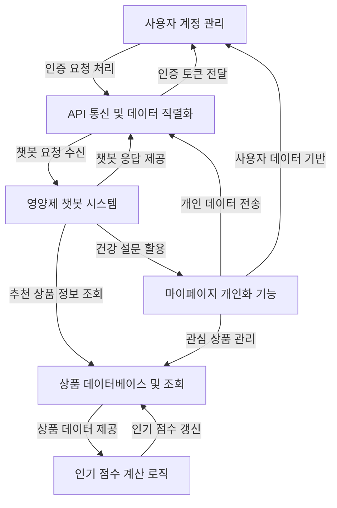

#  (Trend of Pill)

**TOP**는 넘쳐나는 정보 속에서 어떤 영양제를 선택해야 할지 고민하는 분들을 위해 탄생한 **AI 기반 대화형 맞춤 영양제 추천 챗봇 서비스**입니다.

<br/>

## 목차

#### 1. [프로젝트 개요](#프로젝트-개요)

#### 2. [프로젝트 소개](#프로젝트-소개)

#### 3. [주요 기능](#주요-기능)

#### 4. [추천 시스템](#추천-시스템)

#### 5. [시스템 아키텍처](#시스템-아키텍처)

#### 6. [사용자 시나리오](#사용자-시나리오)

#### 7. [사용 데이터](#사용-데이터)

#### 8. [실행 방법](#실행-방법)

#### 9. [시연 영상](#시연-영상)

<br/>

## 프로젝트 개요

### 팀원

|이름|역할|메인 업무|깃허브|
|---|---|---|---|
|**최수헌**|팀장|프로젝트 관리 및 LLM|[HoneyWater8](https://github.com/HoneyWater8)|
|**권석현**|팀원|DB|[seo-droid](https://github.com/seo-droid)|
|**원유형**|팀원|Fine-tuning 및 AWS|[uhyeong](https://github.com/uhyeong)|
|**좌민서**|팀원|추천 시스템|[INe](https://github.com/INe904)|
|**홍승표**|팀원|웹 개발|[redwin02](https://github.com/redwin-02)|

### 기술 스택

#### 화면 설계


#### 웹

    

#### 데이터 수집 및 전처리

   


#### 데이터베이스

  

#### LLM

 


#### 인프라

 

#### 버전 관리 및 협업


  

### 프로젝트 구조

```bash
SKN10-FINAL-2TEAM/
├─ db/                      # 데이터베이스 관련 파일 및 설정
├─ django-server/           # Django 서버
└─ recommendation/          # 추천 알고리즘 및 모델 학습
```

<br/>

## 프로젝트 소개

### 문제 정의

#### 1. 정보 과잉

- 수많은 영양제 정보와 광고 속에서 어떤 제품이 실제로 효과가 있는지 판단하기 어렵다.
- 인터넷 후기나 마케팅 광고에 의존한 비체계적 정보 소비가 많아, 잘못된 제품 선택으로 이어질 수 있다.

#### 2. 개인 맞춤 정보 부족

- 개인의 질병 이력, 복용 약물, 건강 상태, 생활 습관, 영양 불균형 등을 고려한 맞춤형 정보가 부족하여 개인에게 맞는 영양제를 찾기 어렵다.
- 사용자는 본인에게 맞는 영양제를 정확히 파악하지 못해 성분 중복, 부작용 등 건강 리스크가 존재한다.

#### 3. 성분 및 효능에 대한 이해 부족

- 일반 사용자들이 영양제 성분표를 정확히 이해하고 자신에게 필요한 성분을 파악하기 어렵다.
- 정보 없이 건강기능식품을 선택하는 소비자가 많아 올바른 정보 제공이 필요하다.

### 기대 효과

#### 1. 시간 절약 및 효율적인 정보 습득

- 챗봇과의 자연스러운 대화를 통해 개인에게 최적화된 영양제 정보를 신속하게 얻고, 탐색 시간을 대폭 줄일 수 있다.
- 체계적이고 정확한 정보 기반으로 영양제를 추천하여 사용자에게 신뢰성 있는 추천을 제공한다.

#### 2. 오류 없는 맞춤형 영양제 선택

- 개인의 건강 상태, 생활 습관, 복용 약물 등을 종합적으로 고려한 추천을 통해 불필요하거나 부작용의 위험이 있는 영양제 선택을 방지하고, 건강 개선 효과를 극대화할 수 있다.

#### 3. 데이터 기반 추천 시스템 고도화

- 사용자들의 질문 및 선택 데이터를 축적하여 추천 알고리즘을 지속적으로 개선하고 LLM 챗봇 기반 개인 맞춤형 상품 추천 시스템을 고도화할 수 있다.

#### 4. 고객 만족도 및 신뢰도 향상

- 정확하고 개인화된 상품 정보 제공을 통해 사용자 만족도를 높이고, 상품 추천에 대한 신뢰를 구축하여 서비스 재이용률을 높일 수 있다.

<br/>

## 주요 기능

- LLM 기반 자연어 질문 응답
- 개인 맞춤형 영양제 추천
- 성분 기반 필터링
- 인기 점수 및 평점 기반 추천 알고리즘
- 사용자 상호작용 로그 기반 추천 시스템

<br/>

## 추천 시스템

### 비개인화 추천 시스템

- 감성 분석 기반 만족도 추천
  - 사용자 리뷰를 LLM으로 분석하여 긍정률 기반 추천

- 판매 순위 기반 추천
  - Amazon의 카테고리별 랭킹 활용

- 가성비 추천
  - 가격 대비 평점 최적 상품 추천

### 개인화 추천 시스템

- ASRec 및 S3Rec
  - 사용자의 행동 데이터를 기반으로 상품 추천

  - 모델 비교 후 최선의 모델 선택

<br/>

## 시스템 아키텍처



<br/>

## 사용자 시나리오

```text
1. 사용자 로그인
2. 마이페이지의 설문조사 진행
3. 챗봇을 통한 고도화된 영양제 추천
4. Amazon 사이트 이동 후 구매
```

⇒ 추후 고도화 예정

<br/>

## 사용 데이터

- [**Amazon 영양제 상품 데이터 및 리뷰 데이터**](https://www.amazon.com/)

- [**한국인 영양소 섭취기준**](https://www.kns.or.kr/FileRoom/FileRoom_view.asp?mode=mod&restring=%252FFileRoom%252FFileRoom.asp%253Fxsearch%253D0%253D%253Dxrow%253D10%253D%253DBoardID%253DKdr%253D%253Dpage%253D1&idx=125&page=1&BoardID=Kdr&xsearch=1&cn_search=)

- **영양소 효능 데이터**
- **건강 관련 키워드 태그 데이터**

<br/>

## 실행 방법

### 1. 프로젝트 클론

```bash
git clone https://github.com/SKNETWORKS-FAMILY-AICAMP/SKN10-FINAL-2Team.git
cd SKN10-FINAL-2Team
```

### 2. 가상환경 생성 및 라이브러리 설치

```bash
cd ../django-server
uv venv .venv -p 3.13
.\.venv\Scripts\activate
uv pip install -r requirements.txt
```

### 3. 서비스 실행

```bash
python manage.py makemigrations
python manage.py migrate
python manage.py runserver
```

<br/>

## 시연 영상

⇒ 추후 업로드 예정

<br/>

