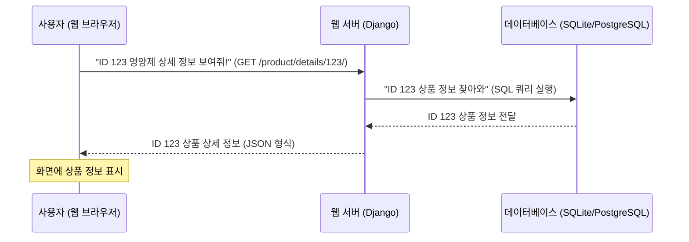

# Chapter 1: 상품 데이터베이스 및 조회


안녕하세요! `SKN10-FINAL-2Team` 프로젝트 튜토리얼의 첫 번째 챕터에 오신 것을 환영합니다. 이 챕터에서는 우리 프로젝트의 가장 기본이 되는 정보, 즉 `영양제 상품 데이터`를 어떻게 저장하고, 필요할 때 어떻게 찾아오는지에 대해 알아보겠습니다.

## 1. 상품 데이터베이스는 왜 필요할까요?

우리가 만드는 서비스는 다양한 영양제 상품 정보를 사용자에게 제공해야 합니다. 마치 수많은 책이 꽂혀 있는 거대한 도서관이나, 궁금한 정보가 가득한 백과사전과 같죠.

만약 수많은 영양제 상품 정보를 체계적으로 정리해두지 않는다면 어떻게 될까요?
*   사용자가 특정 영양제를 검색했을 때 정보를 찾기 어렵고,
*   챗봇이 어떤 영양제를 추천해달라고 했을 때 관련 정보를 빠르게 가져올 수 없을 겁니다.
*   새로운 영양제 정보가 추가되거나 기존 정보가 변경될 때마다 전체를 수동으로 관리하는 것은 거의 불가능하겠죠.

이러한 문제를 해결하기 위해 `상품 데이터베이스`가 필요합니다. 데이터베이스는 상품의 제목, 브랜드, 성분, 가격, 평점 등 모든 상세 정보를 질서정연하게 저장하고 관리하는 '영양제 백과사전'과 같은 역할을 합니다. 사용자가 특정 상품을 찾거나 챗봇이 상품 정보를 보여줄 때, 이 백과사전에서 필요한 정보를 빠르고 정확하게 가져와 제공할 수 있게 됩니다.

## 2. '영양제 백과사전' 살펴보기: 상품 데이터의 구조

우리 프로젝트에서 영양제 상품은 어떤 정보들을 가지고 있을까요? 마치 백과사전의 각 페이지마다 제목, 저자, 내용 등이 있듯이, 우리 영양제 백과사전의 각 상품은 다음과 같은 상세 정보들을 가집니다.

*   **제목 (title):** 영양제의 이름
*   **브랜드 (brand):** 제조사 또는 판매 브랜드
*   **성분 (ingredients):** 영양제에 포함된 성분 목록
*   **복용법 (directions):** 영양제 섭취 방법
*   **가격 (total_price):** 상품의 총 가격
*   **평점 (average_rating):** 사용자 리뷰의 평균 평점
*   **리뷰 수 (total_reviews):** 총 리뷰 개수
*   **비건 여부 (vegan):** 비건(채식주의자)에게 적합한지 여부
*   **이미지 (image_link):** 상품 이미지 링크

이 외에도 다양한 정보들이 체계적으로 저장됩니다. 이러한 정보의 구조는 Django의 `models.py` 파일에 정의되어 있습니다. 이것은 데이터베이스에 어떤 종류의 데이터를 저장할 것인지, 그리고 그 데이터들이 어떤 형식으로 저장될 것인지를 미리 약속하는 것입니다.

**`django-server\Product\models.py`** 파일의 일부를 살펴볼까요?

```python
# django-server\Product\models.py
from django.db import models

class Products(models.Model):
    url = models.URLField()
    title = models.CharField(max_length=500)
    # ... (생략: 다른 정보들) ...
    brand = models.CharField(max_length=255, blank=True)
    ingredients = models.TextField(blank=True)
    directions = models.TextField(blank=True)
    average_rating = models.FloatField(null=True, blank=True)
    total_reviews = models.IntegerField(null=True, blank=True)
    image_link = models.URLField(blank=True)
    total_price = models.FloatField(null=True, blank=True)
    vegan = models.CharField(max_length=30, blank=True)
    # ... (생략) ...

    def __str__(self):
        return self.title
```

위 코드는 `Products`라는 이름의 모델을 정의하고 있습니다. 여기서 `models.URLField`, `models.CharField`, `models.FloatField` 등은 해당 필드(정보 항목)에 어떤 종류의 데이터가 저장될지를 알려줍니다. 예를 들어 `title`은 최대 500자까지의 문자열로 저장되고, `average_rating`은 소수점까지 저장할 수 있는 숫자로 저장된다는 의미입니다.

## 3. '영양제 백과사전'에서 정보 '조회'하기

이제 데이터가 어떻게 저장되는지 알았으니, 저장된 데이터를 어떻게 찾아오는지 알아봅시다. 사용자가 특정 영양제 상세 정보를 보고 싶어 할 때, 또는 챗봇이 추천한 영양제의 상세 정보를 제공해야 할 때, 우리는 '영양제 백과사전'에서 해당 정보를 '조회'해야 합니다.

가장 대표적인 방법은 웹 주소(URL)를 통해 특정 상품의 정보를 요청하는 것입니다. 예를 들어, `example.com/product/details/123/` 와 같은 주소는 "ID가 123인 상품의 상세 정보를 보여주세요"라는 요청이 됩니다.

이러한 요청이 들어왔을 때, 우리 서비스는 다음과 같은 단계를 거쳐 정보를 찾아 사용자에게 전달합니다.



### 3.1. 웹 서버의 '정보 데스크': `views.py`

사용자의 요청을 받아 데이터를 조회하고 응답하는 역할은 Django의 `views.py` 파일이 담당합니다. 마치 백화점의 '정보 데스크' 직원처럼, 요청을 듣고 필요한 정보를 찾아 고객에게 전달하는 역할을 합니다.

**`django-server\Product\views.py`** 파일의 `get_product_details` 함수를 살펴볼까요?

```python
# django-server\Product\views.py
from django.shortcuts import get_object_or_404
from django.http import JsonResponse
from .models import Products # 위에서 정의한 Products 모델을 가져옵니다.

def get_product_details(request, product_id=None):
    """
    단일 상품 또는 여러 상품의 상세 정보를 반환하는 API
    """
    try:
        if product_id:
            # 단일 상품 조회
            # Products 모델에서 id가 product_id와 일치하는 상품을 찾습니다.
            # 없으면 404 에러를 발생시킵니다.
            product = get_object_or_404(Products, id=product_id)
            
            # 상품 정보를 딕셔너리 형태로 만듭니다.
            product_data = {
                'id': product.id,
                'title': product.title,
                'brand': product.brand,
                # ... (생략: 다른 상품 속성들) ...
                'total_price': product.total_price,
                'image_link': product.image_link,
                'is_liked': False, # 좋아요 여부는 다른 챕터에서 다룹니다.
            }
            # 이 딕셔너리를 JSON 형식으로 사용자에게 응답합니다.
            return JsonResponse(product_data)
        # ... (생략: 여러 상품 조회 로직) ...
    except Exception as e:
        return JsonResponse({'error': f'오류가 발생했습니다: {str(e)}'}, status=500)
```

이 코드를 간단히 설명하자면:
1.  `get_product_details` 함수는 웹 요청(`request`)과 `product_id` (상품 고유 번호)를 받습니다.
2.  `get_object_or_404(Products, id=product_id)`는 `Products` 모델(우리의 영양제 백과사전)에서 요청받은 `product_id`와 일치하는 상품을 찾아옵니다. 만약 해당 ID의 상품이 없다면 "페이지를 찾을 수 없습니다"라는 의미의 404 에러를 자동으로 발생시킵니다.
3.  찾아온 `product` 객체에서 필요한 정보들(`id`, `title`, `brand`, `total_price` 등)을 뽑아 딕셔너리(`product_data`) 형태로 만듭니다.
4.  마지막으로 `JsonResponse(product_data)`를 사용하여 이 딕셔너리 형태의 데이터를 `JSON` (JavaScript Object Notation)이라는 웹에서 데이터를 주고받기 쉬운 형태로 변환하여 사용자에게 응답으로 보냅니다.

**예시: API 호출 및 응답**

사용자가 `GET /product/details/1/` (ID가 1인 상품 요청)을 보낸다고 가정해봅시다.
그러면 `get_product_details` 함수가 실행되고, 데이터베이스에서 ID가 1인 상품 정보를 찾아 다음과 같은 JSON 응답을 보낼 것입니다.

**출력 (JSON 응답 예시):**

```json
{
    "id": 1,
    "url": "http://example.com/product/1",
    "title": "비타민 C 1000mg",
    "safety_info": "어린이 손이 닿지 않는 곳에 보관...",
    "ingredients": "비타민 C, 기타 첨가물...",
    "directions": "하루 1회 1정 복용...",
    "brand": "건강앤",
    "flavor": "오렌지",
    "supplement_type": "비타민",
    "quantity": "60정",
    "product_form": "캡슐",
    "average_rating": 4.7,
    "total_reviews": 125,
    "image_link": "http://example.com/images/vitamin_c.jpg",
    "total_price": 25.99,
    "price_value": 0.43,
    "vegan": "Yes",
    "country_of_origin": "미국",
    "is_liked": false
}
```

### 3.2. 웹 주소와 '정보 데스크' 연결하기: `urls.py`

우리가 웹 주소(URL)를 통해 `views.py`의 함수를 호출할 수 있는 것은 `urls.py` 파일 덕분입니다. 이 파일은 어떤 주소로 요청이 들어왔을 때, 어떤 `views.py`의 함수를 실행할지 '연결'해주는 역할을 합니다. 마치 도서관의 '주소록'과 같죠.

**`django-server\Product\urls.py`** 파일의 일부를 살펴볼까요?

```python
# django-server\Product\urls.py
from django.urls import path
from . import views # views.py에서 정의한 함수들을 가져옵니다.

urlpatterns = [
    # 'details/상품ID/' 패턴의 요청이 오면 views.get_product_details 함수를 실행합니다.
    path('details/<int:product_id>/', views.get_product_details, name='product_details'),
    # ... (생략: 다른 URL 패턴들) ...
]
```

여기서 `path('details/<int:product_id>/', views.get_product_details, name='product_details')` 이 한 줄이 핵심입니다.
*   `details/<int:product_id>/`: 이 패턴은 `details/` 다음에 숫자가 오는 모든 주소(`details/1/`, `details/123/` 등)를 의미합니다. `<int:product_id>`는 이 숫자를 `product_id`라는 이름의 정수형 변수로 `views.get_product_details` 함수에 넘겨주라는 뜻입니다.
*   `views.get_product_details`: 이 주소로 요청이 오면 `views.py` 파일 안에 있는 `get_product_details` 함수를 실행하라고 연결합니다.
*   `name='product_details'`: 이 URL 패턴에 `product_details`라는 이름을 붙여줍니다. 나중에 코딩할 때 이 이름을 통해 URL을 쉽게 참조할 수 있습니다.

### 3.3. 정보를 사용자에게 보여주기: `product_card.html` 및 `product_detail_modal.html`

백엔드(서버)에서 데이터를 잘 조회하여 JSON 형태로 사용자에게 보냈다면, 이제 프론트엔드(사용자 화면)에서는 이 데이터를 받아서 보기 좋게 화면에 표시해야 합니다.

`django-server\templates\Product\product_card.html`과 `django-server\templates\Product\product_detail_modal.html` 파일은 조회된 상품 정보를 화면에 예쁘게 보여주는 HTML 코드와 Django 템플릿 태그로 이루어져 있습니다.

**`django-server\templates\Product\product_card.html`** 의 아주 작은 부분만 보겠습니다.

```html
{# django-server\templates\Product\product_card.html #}
<div class="product-card" data-product-id="{{ product.id }}">
    <div class="product-image">
        
            
        
            <div class="no-image">이미지 없음</div>
        
    </div>
    <div class="product-info">
        <h3 class="product-title">{{ product.title }}</h3>
        <p class="product-brand">{{ product.brand|default:'' }}</p>
        {# ... (생략: 다른 정보 표시) ... #}
    </div>
</div>
```

위 코드에서 `{{ product.id }}`, `{{ product.image_link }}`, `{{ product.title }}`, `{{ product.brand }}`와 같은 부분들이 보이시나요? 이것들은 Django 템플릿 문법으로, `views.py`에서 전달받은 `product` 객체의 각 속성(`id`, `image_link`, `title`, `brand` 등)의 값을 가져와서 HTML 페이지에 실제로 표시해주는 역할을 합니다.

예를 들어, `views.py`에서 `product` 객체에 "비타민 C 1000mg"이라는 `title` 값이 담겨 있다면, `{{ product.title }}` 부분에는 "비타민 C 1000mg"이라는 글자가 화면에 나타나게 됩니다.

이처럼 `models.py`로 데이터 구조를 정의하고, `views.py`로 요청을 처리하고 데이터를 조회하며, `urls.py`로 주소를 연결하고, `HTML 템플릿`으로 데이터를 사용자에게 보여주는 과정이 바로 '상품 데이터베이스 및 조회'의 핵심이라고 할 수 있습니다.

## 결론

이번 챕터에서는 우리 프로젝트에서 영양제 상품 정보를 어떻게 체계적으로 저장하고(데이터베이스), 사용자의 요청에 따라 어떻게 빠르고 정확하게 찾아오는지(조회)에 대해 배웠습니다. `models.py`로 데이터의 형태를 정의하고, `urls.py`로 웹 주소를 연결하며, `views.py`로 실제 데이터를 조회하고 응답하는 전체적인 흐름을 이해하는 것이 중요합니다.

이제 우리는 상품 데이터를 잘 관리하고 조회할 수 있게 되었습니다. 다음 챕터에서는 이 상품 데이터에 '인기 점수'를 어떻게 부여하고 계산하는지 알아보겠습니다. 단순히 데이터를 보여주는 것을 넘어, 사용자에게 더 유용한 정보를 제공하는 첫 단계가 될 것입니다.

[챕터 2: 인기 점수 계산 로직](02_인기_점수_계산_로직_.md)

---

Generated by [AI Codebase Knowledge Builder](https://github.com/The-Pocket/Tutorial-Codebase-Knowledge)