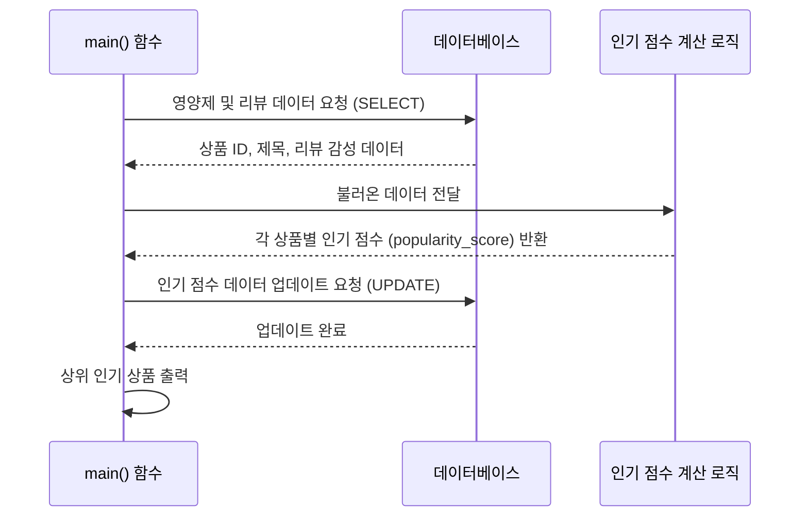

# Chapter 2: 인기 점수 계산 로직

안녕하세요! `SKN10-FINAL-2Team` 프로젝트 튜토리얼의 두 번째 챕터에 오신 것을 환영합니다. [챕터 1: 상품 데이터베이스 및 조회](01_상품_데이터베이스_및_조회_.md)에서는 우리 프로젝트가 영양제 상품 정보를 어떻게 저장하고, 필요할 때 어떻게 찾아오는지 배웠습니다. 이제 우리는 단순히 정보를 보여주는 것을 넘어, 사용자들에게 "어떤 영양제가 가장 좋은가요?"라는 질문에 객관적인 답을 줄 수 있는 방법을 알아볼 차례입니다.

## 1. '진짜' 인기 있는 영양제는 어떻게 찾을까요?

여러분은 어떤 식당을 선택할 때, 단순히 '평점'만 보고 결정하시나요? 예를 들어, 어떤 식당은 평점 5점 만점에 1개만 있고, 다른 식당은 평점 4.5점에 리뷰가 1000개 있다면 어느 식당이 더 인기가 많다고 생각하시나요? 아마 대부분의 사람은 후자를 선택할 것입니다.

영양제도 마찬가지입니다. 단순히 평균 평점만으로는 상품의 '진정한 인기'를 파악하기 어렵습니다. 평점이 아무리 높아도 리뷰 수가 적다면 그 평점은 신뢰하기 어렵기 때문이죠. 반대로 평점이 조금 낮더라도 수많은 긍정적인 리뷰가 있다면, 그 상품은 실제로 많은 사용자에게 사랑받는다고 볼 수 있습니다.

우리 프로젝트에서는 이러한 문제를 해결하기 위해 `인기 점수 계산 로직`을 도입했습니다. 마치 '인기 순위 집계 위원회'처럼, 단순히 높은 평점뿐만 아니라 **총 리뷰 수**와 **긍정적인 리뷰의 비율**을 복합적으로 고려하여 각 영양제 상품의 인기도를 하나의 '가중 평균 평점'으로 산출하는 내부 알고리즘입니다. 이 점수를 통해 우리는 "이 영양제가 실제 사용자들에게 얼마나 긍정적으로 평가받고 있나?"를 객관적인 수치로 파악할 수 있게 됩니다.

## 2. 인기 점수, 어떻게 계산될까요?

그렇다면 이 '인기 점수'는 어떻게 계산될까요? 핵심은 다음과 같습니다.

*   **리뷰 수의 중요성**: 리뷰가 많을수록 평점의 신뢰도가 높아집니다.
*   **긍정적인 리뷰의 비율**: 전체 리뷰 중 긍정적인 리뷰가 차지하는 비율이 높을수록 좋습니다.
*   **가중치 부여**: 위 두 요소를 적절히 조합하여 '진정한 인기'를 반영하는 점수를 만듭니다.

우리는 이 점수를 계산하기 위해 'Steam 게임 평점' 방식을 변형하여 사용합니다. Steam은 전 세계적으로 유명한 게임 플랫폼으로, 수많은 게임의 사용자 평점을 집계할 때 이 방식을 사용합니다. 이 방식은 리뷰 수가 적은 상품의 평점은 보수적으로 보고, 리뷰 수가 많을수록 실제 평점에 가깝게 만드는 특징이 있습니다.

최종적으로 계산된 점수는 0에서 1 사이의 값으로 정규화(Normalization)되어, 사용자가 한눈에 인기도를 비교할 수 있도록 합니다. 1에 가까울수록 매우 인기가 많고, 0에 가까울수록 인기가 없거나 리뷰가 거의 없는 상품을 의미합니다.

## 3. 인기 점수 계산 및 업데이트 흐름 살펴보기

이제 실제로 이 인기 점수가 어떻게 계산되고 우리 데이터베이스에 저장되는지 알아봅시다. 이 과정은 주로 서버에서 주기적으로 실행되거나, 새로운 리뷰가 등록될 때마다 업데이트될 수 있습니다.

### 3.1. 전체 파이프라인 개요

우리 프로젝트에서는 `recommendation\preprocessing\popularity_process.py` 파일의 `main()` 함수가 이 인기 점수 계산의 전체 과정을 담당합니다. 이 함수는 다음 세 단계를 거쳐 인기 점수를 계산하고 데이터베이스에 업데이트합니다.

1.  **데이터 불러오기**: 데이터베이스에서 모든 영양제 상품과 해당 상품에 달린 리뷰 데이터를 가져옵니다. 이때, 리뷰가 긍정적인지(positive) 부정적인지(negative)에 대한 정보도 함께 가져옵니다.
2.  **인기 점수 계산**: 불러온 데이터를 바탕으로 각 상품별 '인기 점수'를 계산합니다. 이 과정에서 리뷰 수와 긍정 리뷰 비율이 반영됩니다.
3.  **점수 저장**: 계산된 인기 점수를 각 상품에 해당하는 데이터베이스 컬럼(`popularity_score`)에 업데이트하여 저장합니다.

간단한 흐름을 시퀀스 다이어그램으로 살펴볼까요?



### 3.2. 데이터 불러오기: `load_data` 함수

가장 먼저 할 일은 점수를 계산할 '재료'인 영양제와 리뷰 데이터를 가져오는 것입니다. `recommendation\common\database.py` 파일에 있는 `load_data` 함수가 이 역할을 합니다.

```python
# recommendation\common\database.py (일부)
from dotenv import load_dotenv
import psycopg2
import os
import pandas as pd

# .env 파일에서 환경변수 로드 및 db_params 설정 생략
# ...

def load_data(query):
    """
    데이터베이스에서 데이터를 조회하여 pandas DataFrame으로 반환합니다.
    """
    conn = psycopg2.connect(**db_params) # 데이터베이스에 연결
    df = pd.read_sql(query, conn) # 쿼리를 실행하고 결과를 DataFrame으로 변환
    conn.close() # 연결 종료
    return df
```

이 함수는 SQL 쿼리를 인자로 받아 데이터베이스에서 데이터를 조회한 후, `pandas`라는 파이썬 라이브러리의 `DataFrame` 형태로 데이터를 변환하여 반환합니다. `DataFrame`은 엑셀 시트처럼 행과 열로 구성된 표 형태의 데이터 구조로, 데이터를 다루기 매우 편리합니다.

`main` 함수에서는 다음과 같은 쿼리를 사용해서 데이터를 불러옵니다.

```python
# recommendation\preprocessing\popularity_process.py (main 함수 일부)
# ...
def main():
    query = '''
    SELECT p.id, p.title, r.sentiment
    FROM "Product_products" p
    INNER JOIN "Product_review" r
    ON p.id = r.product_id
    '''
    df = load_data(query) # 데이터베이스에서 데이터 불러오기
    # ...
```

위 쿼리는 `Product_products` 테이블(영양제 상품 정보)과 `Product_review` 테이블(사용자 리뷰 정보)을 서로 연결(INNER JOIN)하여, 각 상품(`p.id`, `p.title`)과 해당 상품에 달린 리뷰의 감성(`r.sentiment` - 'positive' 또는 'negative') 정보를 함께 가져옵니다.

### 3.3. 인기 점수 계산: `calculate_scores` 함수

이제 핵심인 인기 점수 계산 단계입니다. `recommendation\preprocessing\popularity_process.py` 파일의 `calculate_scores` 함수가 이 작업을 수행합니다.

```python
# recommendation\preprocessing\popularity_process.py (일부)
from common.popularity_calculate import steam_game_scores, min_max_scaler # 핵심 계산 함수 가져오기

def calculate_scores(df):
    # 1. 'sentiment' 컬럼을 True/False (긍정/부정)로 변환
    df['sentiment'] = df['sentiment'] == 'positive'

    # 2. 상품별 총 리뷰 수와 긍정 리뷰 수를 집계하고, Steam 평점 계산
    df_star_rating = df.groupby('id').agg({
        'title': 'count',       # 각 상품(id)별 총 리뷰 수
        'sentiment': 'sum'      # 각 상품(id)별 긍정 리뷰 수
    }).rename(columns={
        'title': 'TotalReviews',
        'sentiment': 'PositiveReviews'
    }).apply(lambda x: steam_game_scores(x['TotalReviews'], x['PositiveReviews']), axis=1)

    # 3. 계산된 reviews_rating을 0~1 사이로 정규화
    max_rating = df_star_rating['reviews_rating'].max()
    min_rating = df_star_rating['reviews_rating'].min()
    df_star_rating['scaled_reviews_rating'] = min_max_scaler(max_rating, min_rating, df_star_rating['reviews_rating'])

    # 4. 최종 결과 DataFrame 정리 (id, title, popularity_score만 남김)
    df_result = df[['id', 'title']].drop_duplicates().merge(
        df_star_rating[['id', 'scaled_reviews_rating']],
        on='id',
        how='left'
    ).rename(columns={'scaled_reviews_rating': 'popularity_score'})

    # 5. 리뷰가 없는 상품의 점수는 0으로 처리
    df_result['popularity_score'] = df_result['popularity_score'].fillna(0)

    return df_result
```

이 함수는 여러 단계를 거치는데, 핵심은 다음 두 가지 도우미 함수에 있습니다.

#### 3.3.1. `steam_game_scores` 함수: '리뷰 신뢰도' 반영 평점 계산

`recommendation\common\popularity_calculate.py`에 정의된 `steam_game_scores` 함수는 `TotalReviews` (총 리뷰 수)와 `PositiveReviews` (긍정 리뷰 수)를 받아서 Steam 방식의 평점(`reviews_rating`)을 계산합니다.

```python
# recommendation\common\popularity_calculate.py (일부)
import pandas as pd
import numpy as np

def steam_game_scores(TotalReviews, PositiveReviews):
    """
    총 리뷰 수와 긍정 리뷰 수를 바탕으로 Steam 방식 평점을 계산합니다.
    """
    if TotalReviews == 0:
        return pd.Series({'positive_reviews': 0, 'negative_reviews': 0, 'reviews_rating': 0})
    
    ReviewScore = PositiveReviews / TotalReviews # 긍정 리뷰 비율
    # 이 복잡한 공식이 리뷰 수에 따른 가중치를 부여합니다.
    Rating = ReviewScore - (ReviewScore - 0.5) * 2 ** (-np.log10(TotalReviews + 1))
    
    return pd.Series({
        'positive_reviews': PositiveReviews,
        'negative_reviews': TotalReviews - PositiveReviews,
        'reviews_rating': Rating
    })
```

이 함수는 핵심적인 계산을 수행합니다. 공식 자체는 복잡해 보이지만, 기본 아이디어는 "리뷰 수가 많을수록 `ReviewScore`(긍정 리뷰 비율)에 가까운 `Rating`을 내주고, 리뷰 수가 적을수록 `0.5` (중립)에 가까운 `Rating`을 내준다"는 것입니다. 예를 들어, 5점 만점 1개인 상품은 0.5에 가까운 낮은 점수를 받고, 4.5점 1000개인 상품은 4.5점에 가까운 높은 점수를 받게 됩니다.

#### 3.3.2. `min_max_scaler` 함수: 점수를 0~1 사이로 정규화

계산된 `reviews_rating` 값들은 -1부터 1 사이의 범위(정확히는 -0.5 ~ 1.0)에 있을 수 있습니다. 사용자에게 보여주거나 다른 점수와 비교하기 쉽게 하기 위해, 이 점수들을 0에서 1 사이의 값으로 '정규화'합니다. `recommendation\common\popularity_calculate.py`의 `min_max_scaler` 함수가 이 역할을 합니다.

```python
# recommendation\common\popularity_calculate.py (일부)
def min_max_scaler(max_rating, min_rating, reviews_rating):
    """
    주어진 min/max 값을 기준으로 점수를 0~1 사이로 정규화합니다.
    """
    # (현재 점수 - 최소 점수) / (최대 점수 - 최소 점수) 공식을 사용합니다.
    return (reviews_rating - min_rating) / (max_rating - min_rating)
```

이 함수는 이름 그대로 최소-최대 정규화(Min-Max Scaling)를 수행합니다. 가장 낮은 점수는 0, 가장 높은 점수는 1이 되도록 모든 점수를 비율에 맞게 조정합니다. 이렇게 조정된 `scaled_reviews_rating`이 최종적으로 `popularity_score`로 사용됩니다.

### 3.4. 점수 데이터베이스에 저장: `save_data_to_db` 함수

마지막으로 계산된 `popularity_score`를 데이터베이스의 해당 상품 정보에 업데이트해야 합니다. 이는 `recommendation\common\database.py` 파일의 `save_data_to_db` 함수가 담당합니다.

```python
# recommendation\common\database.py (일부)
def save_data_to_db(query, data):
    """
    데이터프레임의 점수 컬럼을 데이터베이스에 업데이트합니다.
    """
    conn = psycopg2.connect(**db_params) # 데이터베이스 연결
    cur = conn.cursor() # 쿼리 실행을 위한 커서 생성
    try:
        cur.executemany(query, data) # 여러 개의 데이터를 한 번에 업데이트
        conn.commit() # 변경사항 저장
    except Exception as e:
        print("DB update error:", e)
        conn.rollback() # 에러 발생 시 롤백
    finally:
        cur.close()
        conn.close() # 연결 종료
```

`main` 함수에서는 다음과 같은 `UPDATE` 쿼리와 데이터를 준비하여 `save_data_to_db` 함수를 호출합니다.

```python
# recommendation\preprocessing\popularity_process.py (main 함수 일부)
# ...
def main():
    # ... (점수 계산 부분 생략) ...

    # 데이터베이스에 점수 저장
    query = '''
    UPDATE "Product_products"
    SET popularity_score = %s
    WHERE id = %s
    '''
    # 계산된 점수와 상품 ID를 튜플 리스트 형태로 만듭니다.
    data = [(row['popularity_score'], row['id']) for _, row in df.iterrows()]
    save_data_to_db(query, data)

    # 상위 인기 상품 출력 (확인용)
    print("Scores saved to DB:")
    print(df[['title', 'popularity_score']].sort_values(by='popularity_score', ascending=False).head())

if __name__ == "__main__":
    main()
```

이 코드는 `Product_products` 테이블에서 각 상품의 `id`에 해당하는 `popularity_score` 값을 업데이트합니다. `executemany` 함수를 사용하여 여러 상품의 점수를 한 번에 효율적으로 업데이트할 수 있습니다.

**출력 (예시):**

이 `main` 함수가 실행되면, 터미널에 다음과 같은 형태로 상위 인기 상품 목록이 출력될 것입니다.

```
Scores saved to DB:
          title  popularity_score
0     비타민 C 1000mg      0.987654
1    오메가-3 캡슐 (EPA+DHA)      0.954321
2  프로바이오틱스 100억 유산균      0.921098
3  종합 비타민 프리미엄      0.887876
4       칼슘 마그네슘 비타민D      0.854653
```

이제 우리 데이터베이스의 각 영양제 상품 정보에는 `popularity_score`라는 새로운 컬럼에 객관적인 인기 점수가 저장됩니다. 이 점수는 나중에 상품 목록을 정렬하거나, 사용자에게 인기 상품을 추천할 때 중요한 기준으로 활용될 것입니다.

## 결론

이번 챕터에서는 영양제 상품의 '진정한 인기'를 객관적인 수치로 나타내는 `인기 점수 계산 로직`에 대해 자세히 알아보았습니다. 단순히 평균 평점만을 보는 것이 아니라, 총 리뷰 수와 긍정적인 리뷰의 비율을 복합적으로 고려하여 가중치를 부여하는 'Steam 게임 평점' 방식을 사용했으며, 이 점수를 0에서 1 사이로 정규화하는 과정도 살펴보았습니다.

핵심적으로 `popularity_process.py` 파일의 `main` 함수가 데이터베이스에서 데이터를 불러오고, `popularity_calculate.py`의 함수들을 사용하여 점수를 계산한 뒤, 다시 데이터베이스에 저장하는 전체 파이프라인을 이해하는 것이 중요합니다.

이제 우리는 상품 데이터를 관리하고, 사용자에게 더 유용한 '인기 있는' 상품 정보를 제공할 준비가 되었습니다. 다음 챕터에서는 사용자들이 우리 서비스를 이용하기 위해 필요한 `사용자 계정 관리` 기능에 대해 알아보겠습니다.

[챕터 3: 사용자 계정 관리](03_사용자_계정_관리_.md)

---

Generated by [AI Codebase Knowledge Builder](https://github.com/The-Pocket/Tutorial-Codebase-Knowledge)