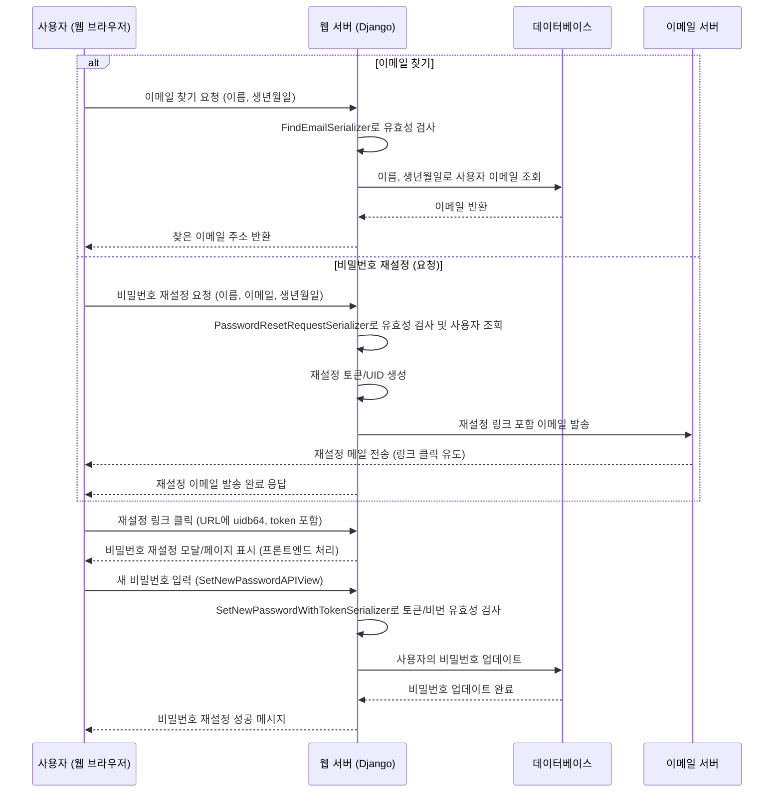
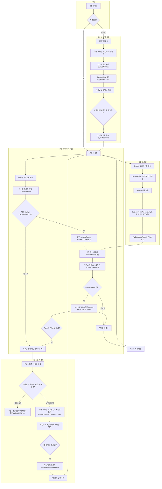

# Chapter 3: 사용자 계정 관리


안녕하세요! `SKN10-FINAL-2Team` 프로젝트 튜토리얼의 세 번째 챕터에 오신 것을 환영합니다. [챕터 1: 상품 데이터베이스 및 조회](01_상품_데이터베이스_및_조회_.md)에서는 우리 프로젝트가 영양제 상품 정보를 어떻게 체계적으로 저장하고 찾아오는지 배웠고, [챕터 2: 인기 점수 계산 로직](02_인기_점수_계산_로직_.md)에서는 상품의 '진정한 인기'를 객관적으로 측정하는 방법을 알아보았습니다.

이제 중요한 질문이 남았습니다. "누가 이 서비스를 이용하는가?", "사용자는 어떻게 서비스에 접속하고 자신을 인증하는가?" 이 질문에 대한 답이 바로 `사용자 계정 관리`입니다.

## 1. '서비스의 신분증 발급소': 사용자 계정 관리는 왜 필요할까요?

여러분이 새로운 웹사이트나 앱을 이용하려고 할 때 가장 먼저 하는 것이 무엇인가요? 보통은 '회원가입'을 하거나, 이미 계정이 있다면 '로그인'을 할 것입니다. 이처럼 사용자가 서비스를 이용하기 위한 첫 관문이 바로 `사용자 계정 관리`입니다.

우리 서비스는 사용자가 자신만의 건강 정보를 관리하고, 맞춤형 영양제를 추천받으며, 개인화된 마이페이지를 이용할 수 있도록 돕습니다. 마치 서비스를 이용하기 위한 '신분증'을 발급하고 관리하는 '신분증 발급소'와 같다고 할 수 있습니다.

만약 사용자 계정을 효율적으로 관리하지 않는다면 어떤 문제가 생길까요?
*   사용자마다 다른 맞춤 정보를 제공하기 어렵습니다.
*   개인의 구매 내역이나 관심 상품을 저장할 수 없습니다.
*   보안이 취약해져 개인 정보가 노출될 위험이 있습니다.
*   서비스 운영자는 누가 서비스를 이용하는지 파악하기 어렵습니다.

이러한 문제를 해결하기 위해 `사용자 계정 관리` 시스템이 필요합니다. 이 시스템은 사용자가 '누구'인지 정확히 확인하고, 안전하게 서비스를 이용할 수 있도록 도와줍니다.

**주요 기능:**
*   **회원가입:** 새로운 사용자가 서비스에 가입합니다.
*   **로그인:** 기존 사용자가 자신의 계정으로 서비스에 접속합니다.
*   **비밀번호 찾기:** 비밀번호를 잊었을 때 재설정할 수 있도록 돕습니다.
*   **소셜 로그인:** 구글 같은 외부 서비스를 통해 간편하게 로그인합니다.
*   **이메일 인증:** 계정의 보안을 강화하고, 본인임을 확인하는 절차입니다.

이 챕터에서는 사용자가 회원가입을 하고 로그인하여 서비스를 이용하는 과정을 중심으로 사용자 계정 관리 시스템의 핵심 기능을 살펴보겠습니다.

## 2. 사용자 계정, 무엇을 관리하나요?

사용자 계정을 관리하기 위해 우리는 어떤 정보를 저장해야 할까요? 우리 프로젝트에서는 `CustomUser`라는 이름의 '사용자 정보 양식'을 정의하여 사용자의 기본적인 정보를 체계적으로 저장하고 관리합니다.

**`django-server\Account\models.py`** 파일의 `CustomUser` 모델을 살펴볼까요?

```python
# django-server\Account\models.py (일부)
from django.contrib.auth.models import AbstractUser, BaseUserManager
from django.db import models

class CustomUser(AbstractUser):
    # 이메일을 주 로그인 필드로 사용 (중복 불가)
    email = models.EmailField(unique=True, null=False, blank=False)
    USERNAME_FIELD = 'email' # Django에서 이 필드를 사용자 이름으로 사용하도록 설정

    birth_date = models.DateField(null=True, blank=True) # 생년월일
    name = models.CharField(max_length=20, null=True, blank=True) # 이름
    
    # 성별 선택 옵션 (남성, 여성)
    GENDER_CHOICES = [
        ('male', '남성'),
        ('female', '여성'),
    ]
    gender = models.CharField(max_length=10, choices=GENDER_CHOICES, null=True, blank=True)
    
    is_verified = models.BooleanField(default=False) # 이메일 인증 여부

    objects = CustomUserManager() # 우리만의 사용자 매니저 사용

    def __str__(self):
        return self.email
```

위 코드는 `CustomUser`라는 사용자 모델을 정의하고 있습니다. 여기서 중요한 점은 Django의 기본 사용자 모델(`AbstractUser`)을 상속받아, `email` 필드를 주 로그인 필드(`USERNAME_FIELD`)로 사용한다는 것입니다. 또한, `birth_date`(생년월일), `name`(이름), `gender`(성별), `is_verified`(이메일 인증 여부)와 같은 우리 서비스에 필요한 추가 정보들을 정의하고 있습니다. `is_verified` 필드는 이메일 인증을 완료했는지 여부를 나타내며, 보안상 매우 중요합니다.

## 3. 회원가입: 새로운 신분증 발급받기

새로운 사용자가 우리 서비스의 회원이 되기 위해 회원가입을 하는 과정입니다.

**사용자 시나리오:**
1.  사용자가 로그인 페이지에서 '회원가입' 링크를 클릭합니다.
2.  회원가입 모달(팝업)이 뜨고, 이름, 이메일, 비밀번호, 생년월일, 성별 정보를 입력합니다.
3.  '회원가입' 버튼을 누르면 서버로 정보가 전송됩니다.
4.  서버는 정보를 검증하고 새 계정을 생성한 뒤, 이메일 인증 메일을 발송합니다.
5.  사용자는 메일함에서 인증 링크를 클릭하여 계정을 활성화합니다.

### 3.1. 사용자 인터페이스: `login.html`

사용자가 회원가입 정보를 입력하는 부분은 `django-server\templates\login\login.html` 파일에 정의되어 있습니다.

```html
{# django-server\templates\login\login.html #}
<div id="signupModal" class="modal">
    <div class="modal-content">
        <span class="close-button" data-modal="signupModal">&times;</span>
        <h2>회원가입</h2>
        <div class="modal-form-group">
            <label for="signupName">이름</label>
            <input type="text" id="signupName" class="modal-input">
        </div>
        <div class="modal-form-group">
            <label for="signupEmail">이메일</label>
            <input type="email" id="signupEmail" class="modal-input">
        </div>
        {# ... (비밀번호, 생년월일, 성별 입력 필드 생략) ... #}
        <button id="signupSubmitButton" class="btn btn-modal-action">회원가입</button>
    </div>
</div>
```

이 HTML 코드는 회원가입을 위한 입력 필드(`input`)와 버튼(`button`)을 포함하고 있습니다. 사용자가 여기에 정보를 입력하면, 다음 섹션에서 볼 `login.js`가 이 데이터를 수집하여 서버로 보냅니다.

### 3.2. 프론트엔드와 백엔드 연결: `login.js`

`django-server\static\js\login.js` 파일은 사용자가 입력한 회원가입 데이터를 서버로 전송하는 역할을 합니다.

```javascript
// django-server\static\js\login.js (일부)
if (signupSubmitButton) {
    signupSubmitButton.addEventListener('click', async function(event) {
        event.preventDefault();

        const name = document.getElementById('signupName').value.trim();
        const email = document.getElementById('signupEmail').value.trim();
        const password = document.getElementById('signupPassword').value;
        const birth_date = document.getElementById('signupBirthdate').value;
        const gender_id_raw = document.getElementById('signupGenderId').value.trim();
        const gender_id = parseInt(gender_id_raw, 10); // 성별 ID (1,2,3,4)

        // ... (간단한 클라이언트 측 유효성 검사 생략) ...

        const userData = { // 서버로 보낼 데이터 객체
            name: name,
            email: email,
            password: password,
            birth_date: birth_date,
            gender_id: gender_id // 프론트에서는 숫자로 받음
        };

        try {
            const response = await fetch('/login/signup/', { // 회원가입 API 호출
                method: 'POST',
                headers: {
                    'Content-Type': 'application/json',
                    'X-CSRFToken': getCookie('csrftoken') // CSRF 토큰은 보안을 위해 필수
                },
                body: JSON.stringify(userData)
            });

            const result = await response.json();

            if (response.ok) { // 회원가입 성공 시
                closeModal(signupModal);
                showSmallInfoPopup(`${name}님, 입력하신 이메일로 인증메일이 발송되었습니다. 인증 후 로그인 가능합니다.`);
                // ... (입력 필드 초기화 생략) ...
            } else { // 회원가입 실패 시
                // ... (에러 메시지 처리 및 표시) ...
                alert(errorMessage);
            }
        } catch (error) {
            console.error('Fetch error:', error);
            alert("네트워크 오류 또는 서버에 연결할 수 없습니다.");
        }
    });
}
```

이 JavaScript 코드는 '회원가입' 버튼이 클릭되면, 입력 필드의 값들을 가져와 JSON 형식으로 만든 후 `/login/signup/` API 엔드포인트로 `POST` 요청을 보냅니다. 요청이 성공하면 회원가입 성공 메시지와 함께 이메일 인증을 요청하는 팝업을 띄웁니다.

### 3.3. 백엔드 데이터 처리: `serializers.py`

서버에서는 사용자가 보낸 데이터를 검증하고 `CustomUser` 모델에 맞게 변환해야 합니다. 이 역할을 `SignupSerializer`가 담당합니다.

**`django-server\Account\serializers.py`** 파일의 `SignupSerializer`를 살펴볼까요?

```python
# django-server\Account\serializers.py (일부)
from rest_framework import serializers
from django.contrib.auth import get_user_model

User = get_user_model()

class SignupSerializer(serializers.ModelSerializer):
    # ... (name, email, password, birth_date 필드 정의 생략) ...
    gender_id = serializers.IntegerField( # 프론트에서 받은 숫자 ID (1,2,3,4)
        help_text="성별을 나타내는 숫자 (1,3: 남성, 2,4: 여성)",
        min_value=1, max_value=4
    )

    class Meta:
        model = User
        fields = ('name', 'email', 'password', 'birth_date', 'gender_id')

    def validate(self, data):
        # 1. 이메일 중복 확인
        if User.objects.filter(email=data.get('email')).exists():
            raise serializers.ValidationError({"email": "이미 등록된 이메일 주소입니다."})
        
        # 2. 비밀번호 길이 확인 (최소 8자)
        if len(data.get('password')) < 8:
            raise serializers.ValidationError({"password": "비밀번호는 최소 8자 이상이어야 합니다."})
        
        # 3. gender_id를 실제 User 모델의 'gender' 필드 값으로 변환
        gender_id = data.get('gender_id')
        gender = None
        if gender_id in [1, 3]:
            gender = 'male'
        elif gender_id in [2, 4]:
            gender = 'female'
        data['gender'] = gender # `User` 모델의 `gender` 필드에 할당될 값

        return data

    def create(self, validated_data):
        # gender_id는 User 모델 필드가 아니므로 제거
        validated_data.pop('gender_id') 
        # validate 메서드에서 추가한 'gender' 필드를 사용
        gender = validated_data.pop('gender') 

        user = User.objects.create_user( # CustomUser 객체 생성
            email=validated_data['email'],
            password=validated_data['password'],
            name=validated_data['name'],
            birth_date=validated_data['birth_date'],
            gender=gender, # 변환된 gender 값 저장
            is_verified=False # 이메일 인증 전이므로 기본값 False
        )
        return user
```

`SignupSerializer`는 사용자가 입력한 데이터의 유효성을 검사합니다. 예를 들어, 이메일이 이미 등록되어 있는지, 비밀번호가 최소 길이를 만족하는지 등을 확인합니다. 특히, 프론트엔드에서 `gender_id`라는 숫자로 받은 성별 정보(예: 남성은 1, 여성은 2)를 실제 `CustomUser` 모델의 `gender` 필드에 맞는 `'male'` 또는 `'female'` 문자열로 변환하여 저장합니다. `create` 메서드는 모든 검증을 통과한 데이터를 바탕으로 실제 `CustomUser` 객체를 생성하고 데이터베이스에 저장합니다. 이때 `is_verified`는 기본적으로 `False`로 설정되어 이메일 인증이 필요함을 나타냅니다.

### 3.4. API 요청 처리: `views.py`

실제 회원가입 요청을 받아서 `SignupSerializer`를 호출하고 사용자 계정을 생성하는 것은 `SignupAPIView`가 담당합니다.

**`django-server\Account\views.py`** 파일의 `SignupAPIView`를 살펴볼까요?

```python
# django-server\Account\views.py (일부)
from rest_framework import generics, status
from rest_framework.response import Response
from allauth.account.utils import send_email_confirmation # 이메일 인증 기능
from .serializers import SignupSerializer
from django.contrib.auth import get_user_model

User = get_user_model()

class SignupAPIView(generics.CreateAPIView):
    queryset = User.objects.all()
    serializer_class = SignupSerializer
    permission_classes = [] # 누구나 회원가입 가능하도록 허용

    def post(self, request, *args, **kwargs):
        serializer = self.get_serializer(data=request.data)
        serializer.is_valid(raise_exception=True) # 유효성 검사 실패 시 에러 반환
        user = serializer.save() # `SignupSerializer`의 create() 메서드 호출, 사용자 생성

        # 회원가입 후 이메일 인증 메일 발송
        try:
            send_email_confirmation(request, user)
        except Exception as e:
            print(f"인증 메일 발송 실패: {e}")
            # 이메일 전송 실패는 회원가입 실패로 이어지지 않게 처리할 수도 있음
            return Response({
                "message": "회원가입은 완료되었으나, 인증 메일 발송에 실패했습니다.",
                "user_email": user.email,
            }, status=status.HTTP_201_CREATED)

        return Response({
            "message": "회원가입이 성공적으로 완료되었습니다. 인증 메일을 확인해주세요.",
            "user_email": user.email,
        }, status=status.HTTP_201_CREATED)
```

`SignupAPIView`는 `POST` 요청이 들어오면 `SignupSerializer`를 사용하여 요청 데이터를 처리하고, 검증된 데이터로 `user` 객체를 생성합니다. 여기서 중요한 것은 `send_email_confirmation(request, user)` 함수입니다. 이 함수는 `django-allauth` 라이브러리가 제공하는 기능으로, 가입된 사용자에게 이메일 인증을 위한 메일을 자동으로 발송합니다. 사용자가 이 메일에 포함된 링크를 클릭하면 계정이 활성화되고, `CustomUser` 모델의 `is_verified` 필드가 `True`로 업데이트됩니다.

### 3.5. 이메일 인증 완료 처리: `signals.py`

사용자가 인증 메일의 링크를 클릭하면 `django-allauth` 내부적으로 `email_confirmed` 시그널(신호)을 발생시킵니다. 우리는 이 시그널을 감지하여 사용자의 `is_verified` 필드를 업데이트합니다.

**`django-server\Account\signals.py`** 파일의 일부입니다.

```python
# Account/signals.py (일부)
from allauth.account.signals import email_confirmed
from django.dispatch import receiver
from django.contrib.auth import get_user_model

User = get_user_model()

@receiver(email_confirmed)
def update_user_is_verified(sender, request, email_address, **kwargs):
    """
    이메일 인증이 성공적으로 완료되었을 때 호출되는 시그널 핸들러.
    사용자 모델의 is_verified 필드를 True로 업데이트합니다.
    """
    try:
        user = User.objects.get(email=email_address.email)
        if not user.is_verified: # 이미 인증되었다면 불필요한 저장 방지
            user.is_verified = True
            user.save()
            print(f"사용자 {user.email}의 이메일 인증 상태가 True로 업데이트되었습니다.")
    except User.DoesNotExist:
        print(f"오류: 이메일 인증을 위한 사용자를 찾을 수 없습니다: {email_address.email}")
```

`@receiver(email_confirmed)` 데코레이터는 `email_confirmed` 시그널이 발생할 때 `update_user_is_verified` 함수를 실행하도록 등록합니다. 이 함수는 이메일 인증이 완료된 사용자의 이메일 주소를 받아 해당 `CustomUser` 객체를 찾은 후, `is_verified` 필드를 `True`로 변경하고 데이터베이스에 저장합니다. 이제 이 사용자는 '인증된' 계정으로 로그인할 수 있게 됩니다.

## 4. 로그인: 발급받은 신분증으로 서비스 입장하기

회원가입 및 이메일 인증을 마친 사용자는 이제 자신의 계정으로 서비스에 로그인할 수 있습니다.

**사용자 시나리오:**
1.  사용자가 로그인 페이지에서 이메일과 비밀번호를 입력합니다.
2.  '로그인' 버튼을 클릭합니다.
3.  서버는 입력된 정보로 사용자를 인증하고, 성공하면 JWT(JSON Web Token)를 발급하여 사용자에게 전달합니다.
4.  사용자의 웹 브라우저는 이 토큰을 저장하고, 이후 서비스 이용 시 이 토큰을 '이용 허가증'처럼 사용합니다.

### 4.1. 사용자 인터페이스: `login.html`

로그인 정보를 입력하는 HTML 부분은 앞서 본 회원가입 모달과 함께 `django-server\templates\login\login.html` 파일에 있습니다.

```html
{# django-server\templates\login\login.html #}
<div class="login-container">
    <div class="login-right">
        <form id="loginForm">
            <div class="form-group">
                <label for="email">이메일</label>
                <input type="email" id="email" name="email" required>
            </div>
            <div class="form-group">
                <label for="password">비밀번호</label>
                <input type="password" id="password" name="password" required>
            </div>
            <button type="submit" class="btn btn-login">로그인</button>
            <a href="" class="btn btn-google">Google 계정 로그인</a>
        </form>
    </div>
</div>
```

이 코드는 사용자가 이메일과 비밀번호를 입력할 수 있는 간단한 로그인 폼을 제공합니다. Google 소셜 로그인 버튼도 눈에 띄는데, 이는 나중에 다시 설명하겠습니다.

### 4.2. 프론트엔드와 백엔드 연결: `login.js` 및 `login_success.html`

`django-server\static\js\login.js`는 로그인 폼이 제출될 때 서버의 로그인 API로 데이터를 보냅니다.

```javascript
// django-server\static\js\login.js (일부)
if (loginForm) {
    loginForm.addEventListener('submit', async function (e) {
        e.preventDefault();
        const email = document.getElementById('email').value.trim();
        const password = document.getElementById('password').value;

        // ... (유효성 검사 생략) ...

        try {
            const response = await fetch('/login/login/', { // 로그인 API 호출
                method: 'POST',
                headers: { 'Content-Type': 'application/json', 'X-CSRFToken': getCookie('csrftoken') },
                body: JSON.stringify({ email: email, password: password })
            });

            const result = await response.json();

            if (response.ok) { // 로그인 성공 시
                console.log("로그인 성공! 토큰:", result.access, result.refresh);
                localStorage.setItem('accessToken', result.access); // Access Token 저장
                localStorage.setItem('refreshToken', result.refresh); // Refresh Token 저장
                window.location.href = '/'; // 메인 페이지로 이동
            } else { // 로그인 실패 시
                // ... (에러 메시지 처리 및 표시) ...
                showLoginFailedPopup('로그인 실패', errorMessage);
            }
        } catch (error) {
            console.error('네트워크 또는 서버 오류:', error);
            showLoginFailedPopup('네트워크 오류', '서버에 연결할 수 없습니다.');
        }
    });
}
```

이 코드는 로그인 폼이 제출되면 입력된 이메일과 비밀번호를 `/login/login/` API로 전송합니다. 서버로부터 `response.ok` (성공) 응답을 받으면, 서버가 발급한 `accessToken`과 `refreshToken`을 웹 브라우저의 `localStorage`에 저장합니다. 이 토큰들은 마치 서비스 이용 '허가증'처럼 작동하여, 이후 사용자가 요청을 보낼 때마다 자신이 누구인지 증명하는 데 사용됩니다.

소셜 로그인(Google)의 경우, Django `allauth` 라이브러리의 흐름을 따릅니다. Google 로그인 성공 시 `django-server\templates\login\login_success.html` 페이지로 리디렉션되며, 이 페이지에서 서버가 세션에 저장한 JWT 토큰을 `localStorage`로 옮깁니다.

```html
<!-- templates/login/login_success.html -->
<!DOCTYPE html>
<html lang="ko">
<head>
  <meta charset="UTF-8">
  <title>로그인 성공</title>
</head>
<body>
  <h1>로그인 중입니다...</h1>

  <!-- Django 템플릿 필터로 JWT 데이터를 JSON 형식으로 삽입 -->
  {{ request.session.jwt|json_script:"jwt-data" }}

  <script>
    try {
      const token = JSON.parse(document.getElementById('jwt-data').textContent);
      if (token.access && token.refresh) {
        localStorage.setItem("accessToken", token.access);
        localStorage.setItem("refreshToken", token.refresh);
        console.log("✅ JWT 저장 완료");
      } else {
        console.warn("⚠️ 토큰이 없습니다.");
      }
    } catch (e) {
      console.error("🚨 토큰 파싱 중 오류:", e);
    }

    // 홈으로 이동
    window.location.href = "/";
  </script>
</body>
</html>
```
이 `login_success.html`은 일반 로그인 또는 소셜 로그인 시 `JWT` 토큰을 웹 브라우저의 `localStorage`에 저장하는 역할을 합니다. 저장된 토큰을 이용해 사용자는 메인 페이지로 이동하여 서비스 이용을 시작할 수 있습니다.

### 4.3. 백엔드 인증 처리: `views.py`

로그인 요청을 처리하는 `LoginAPIView`는 사용자의 이메일과 비밀번호를 받아 인증 절차를 수행하고, 성공 시 JWT 토큰을 발급합니다.

**`django-server\Account\views.py`** 파일의 `LoginAPIView`를 살펴볼까요?

```python
# django-server\Account\views.py (일부)
from rest_framework import generics, status
from rest_framework.response import Response
from django.contrib.auth import authenticate # Django 기본 인증 함수
from rest_framework_simplejwt.tokens import RefreshToken # JWT 토큰 생성

class LoginAPIView(generics.GenericAPIView):
    permission_classes = [] # 누구나 로그인 요청 가능하도록 허용

    def post(self, request, *args, **kwargs):
        email = request.data.get('email')
        password = request.data.get('password')

        if not email or not password:
            return Response({"detail": "이메일과 비밀번호를 모두 입력해주세요."}, status=status.HTTP_400_BAD_REQUEST)

        # Django의 authenticate 함수를 사용하여 사용자 인증 시도
        user = authenticate(request, username=email, password=password) 

        if user is None: # 인증 실패 (이메일 또는 비밀번호 불일치)
            return Response({"detail": "이메일 또는 비밀번호가 올바르지 않습니다."}, status=status.HTTP_401_UNAUTHORIZED)
        
        # 이메일 인증 여부 확인
        if not user.is_verified:
            return Response({"detail": "이메일 인증이 필요합니다. 이메일을 확인해주세요."}, status=status.HTTP_403_FORBIDDEN)

        # 인증 성공 및 이메일 인증 완료 시, JWT 토큰 발급
        refresh = RefreshToken.for_user(user) # Refresh Token 생성
        # Refresh Token으로부터 Access Token 추출

        return Response({
            'message': '로그인 성공!',
            'access': str(refresh.access_token), # Access Token 반환
            'refresh': str(refresh), # Refresh Token 반환
            'user_id': user.id,
            'user_email': user.email,
        }, status=status.HTTP_200_OK)
```

`LoginAPIView`의 `post` 메서드는 사용자가 보낸 이메일과 비밀번호로 `authenticate` 함수를 호출하여 사용자를 인증합니다. 이 `authenticate` 함수는 `settings.py`에 설정된 `AUTHENTICATION_BACKENDS`를 통해 `CustomUser` 모델에 대해 인증을 수행합니다. 인증에 성공하면 사용자의 `is_verified` 필드를 확인하여 이메일 인증이 완료되었는지 확인합니다. 모든 조건이 충족되면 `rest_framework_simplejwt` 라이브러리를 사용하여 `Refresh Token`과 `Access Token`을 생성하고, 이 토큰들을 사용자에게 응답으로 보냅니다.

### 4.4. JWT(JSON Web Token)로 인증 유지하기: `auth.js`

로그인 시 발급받은 `accessToken`과 `refreshToken`은 사용자가 웹 페이지를 이동하거나 다른 API를 호출할 때 자신이 로그인된 사용자임을 증명하는 데 사용됩니다. `django-server\static\js\auth.js` 파일은 이러한 토큰을 관리하고, 필요한 경우 새로운 토큰을 발급받는 로직을 포함합니다.

```javascript
// django-server\static\js\auth.js (일부)
async function checkUserAuthentication() {
    let accessToken = localStorage.getItem('accessToken');
    const refreshToken = localStorage.getItem('refreshToken');

    // 1. Access Token이 없는 경우: 로그인 필요
    if (!accessToken) {
        console.log("Access Token이 없습니다. 로그인해야 합니다.");
        return false;
    }

    // 2. Access Token 유효성 검사 (서버에 확인)
    try {
        const verifyResponse = await fetch('/api/token/verify/', {
            method: 'POST',
            headers: { 'Content-Type': 'application/json', 'Authorization': `Bearer ${accessToken}`, 'X-CSRFToken': getCookie('csrftoken') },
            body: JSON.stringify({ token: accessToken })
        });

        if (verifyResponse.ok) {
            console.log("Access Token이 유효합니다.");
            return true; // Access Token 유효, 인증 완료
        } else if (verifyResponse.status === 401) {
            // Access Token이 만료되었거나 유효하지 않음 -> Refresh Token으로 재발급 시도
            console.warn("Access Token 만료 또는 유효하지 않음. Refresh Token 시도 중...");
            
            if (!refreshToken) {
                console.error("Refresh Token이 없습니다. Access Token을 갱신할 수 없습니다.");
                logoutUser(); // 강제 로그아웃
                return false;
            }

            const refreshResponse = await fetch('/api/token/refresh/', {
                method: 'POST',
                headers: { 'Content-Type': 'application/json', 'X-CSRFToken': getCookie('csrftoken') },
                body: JSON.stringify({ refresh: refreshToken })
            });

            if (refreshResponse.ok) {
                const data = await refreshResponse.json();
                localStorage.setItem('accessToken', data.access); // 새 Access Token 저장
                console.log("Access Token 갱신 성공.");
                return true; // 새 Access Token으로 인증 완료
            } else if (refreshResponse.status === 401) {
                console.error("Refresh Token마저 만료 또는 유효하지 않습니다. 다시 로그인해야 합니다.");
                logoutUser(); // Refresh Token마저 만료, 강제 로그아웃
                return false;
            } else {
                console.error("토큰 갱신 실패:", await refreshResponse.json());
                logoutUser();
                return false;
            }
        } else {
            console.error("토큰 검증 실패 상태:", verifyResponse.status, await verifyResponse.json());
            logoutUser(); // 그 외 알 수 없는 오류는 로그아웃 처리
            return false;
        }

    } catch (error) {
        console.error("네트워크 또는 서버 오류 발생:", error);
        logoutUser();
        return false;
    }
}
```

`checkUserAuthentication` 함수는 사용자가 특정 동작을 수행하기 전, 현재 가지고 있는 `accessToken`이 유효한지 서버에 확인합니다. 만약 `accessToken`이 만료되었다면, `refreshToken`을 사용하여 새로운 `accessToken`을 발급받으려고 시도합니다. 이 과정을 통해 사용자는 매번 로그인할 필요 없이 서비스 이용을 지속할 수 있습니다. 만약 `refreshToken`마저 유효하지 않다면, 사용자는 다시 로그인해야 합니다.

## 5. 비밀번호 찾기: 잃어버린 신분증 재발급받기

비밀번호를 잊어버린 사용자를 위한 기능입니다. 크게 '이메일 찾기'와 '비밀번호 재설정' 두 가지로 나뉩니다.

**비밀번호 찾기 흐름:**



### 5.1. 백엔드 API: `views.py`

`django-server\Account\views.py`에는 이메일 찾기와 비밀번호 재설정을 위한 세 가지 API 뷰가 있습니다.

*   **`FindEmailAPIView`**: 이름과 생년월일을 받아 이메일 주소를 찾아줍니다.

    ```python
    # django-server\Account\views.py (일부)
    class FindEmailAPIView(generics.GenericAPIView):
        permission_classes = [] # 인증 없이 접근 가능
        serializer_class = FindEmailSerializer

        def post(self, request, *args, **kwargs):
            serializer = self.get_serializer(data=request.data)
            serializer.is_valid(raise_exception=True) # 이름, 생년월일로 사용자 찾기
            user = serializer.validated_data['user'] # 찾은 사용자 객체

            return Response({
                "message": "이메일 주소를 찾았습니다.",
                "email": user.email, # 찾은 이메일 반환
            }, status=status.HTTP_200_OK)
    ```

*   **`PasswordResetRequestAPIView`**: 이름, 이메일, 생년월일을 받아 사용자 인증 후 비밀번호 재설정 링크가 포함된 이메일을 발송합니다.

    ```python
    # django-server\Account\views.py (일부)
    class PasswordResetRequestAPIView(generics.GenericAPIView):
        permission_classes = []
        serializer_class = PasswordResetRequestSerializer

        def post(self, request, *args, **kwargs):
            serializer = self.get_serializer(data=request.data)
            serializer.is_valid(raise_exception=True)
            user = serializer.validated_data['user'] # 사용자 인증

            # 비밀번호 재설정 링크 생성 (UID, 토큰 포함)
            uid = urlsafe_base64_encode(force_bytes(user.pk))
            token = default_token_generator.make_token(user)
            reset_link = f"{request.scheme}://{get_current_site(request).domain}/login/?action=reset_password&uidb64={uid}&token={token}"

            # 이메일 템플릿 렌더링 및 발송
            # ... (render_to_string, EmailMultiAlternatives 사용) ...
            email_message.send(fail_silently=False)

            return Response({
                "message": f"비밀번호 재설정 이메일을 {user.email}로 발송했습니다.",
            }, status=status.HTTP_200_OK)
    ```

*   **`SetNewPasswordAPIView`**: 이메일로 받은 링크의 `uidb64` (사용자 ID)와 `token` (인증 토큰), 그리고 새로운 비밀번호를 받아 실제 비밀번호를 재설정합니다.

    ```python
    # django-server\Account\views.py (일부)
    class SetNewPasswordAPIView(generics.GenericAPIView):
        permission_classes = []
        serializer_class = SetNewPasswordWithTokenSerializer

        def post(self, request, *args, **kwargs):
            serializer = self.get_serializer(data=request.data)
            serializer.is_valid(raise_exception=True) # 토큰, UID, 새 비밀번호 유효성 검사
            
            user = serializer.validated_data['user']
            new_password = serializer.validated_data['new_password']

            user.set_password(new_password) # 비밀번호 해싱 및 업데이트
            user.save()

            return Response({
                "message": "비밀번호가 성공적으로 재설정되었습니다.",
            }, status=status.HTTP_200_OK)
    ```
각 API 뷰는 해당하는 `Serializer`를 사용하여 요청 데이터의 유효성을 검사합니다. `FindEmailAPIView`는 이름과 생년월일로 사용자를 찾아 이메일을 반환하고, `PasswordResetRequestAPIView`는 사용자에게 비밀번호 재설정 링크를 이메일로 보냅니다. 마지막으로 `SetNewPasswordAPIView`는 이메일 링크를 통해 받은 `uid`와 `token`을 검증한 후, 새로운 비밀번호로 사용자의 계정을 업데이트합니다.

### 5.2. 프론트엔드 연동: `login.js`

`django-server\static\js\login.js`는 "이메일 찾기" 및 "비밀번호 찾기" 버튼 클릭 이벤트를 처리하고, URL에 비밀번호 재설정 `uid`와 `token`이 있을 경우 자동으로 비밀번호 재설정 모달을 띄웁니다.

```javascript
// django-server\static\js\login.js (일부)

// "이메일 찾기" 버튼 클릭 이벤트
if (findEmailButton) {
    findEmailButton.addEventListener('click', async function() {
        const name = document.getElementById('findEmailName').value.trim();
        const birth_date = document.getElementById('findEmailIdentifier').value;
        // ... (서버로 데이터 전송 및 응답 처리) ...
        const response = await fetch('/login/find-email/', { /* ... */ });
        const result = await response.json();
        if (response.ok) {
            showSmallInfoPopup(`고객님의 이메일 주소는<br><b>${result.email}</b> 입니다.`);
        } else { /* ... */ }
    });
}

// "비밀번호 찾기" 버튼 클릭 이벤트 (재설정 요청)
if (findPasswordButton) {
    findPasswordButton.addEventListener('click', async function() {
        // ... (입력 필드 값 가져오기) ...
        const response = await fetch('/login/password-reset-request/', { /* ... */ });
        const result = await response.json();
        if (response.ok) {
            closeModal(findCredentialsModal);
            showSmallInfoPopup(result.message);
        } else { /* ... */ }
    });
}

// URL 파라미터에서 비밀번호 재설정 정보 확인 후 모달 띄우기
const urlParams = new URLSearchParams(window.location.search);
const action = urlParams.get('action');
const uidb64 = urlParams.get('uidb64');
const token = urlParams.get('token');

if (action === 'reset_password' && uidb64 && token) {
    globalUidb64 = uidb64; // 전역 변수에 저장 (이후 새 비밀번호 설정에 사용)
    globalToken = token;
    openModal(resetPasswordModal); // 비밀번호 재설정 모달 열기
    window.history.replaceState({}, document.title, window.location.pathname); // URL 정리
}

// "비밀번호 재설정" 모달 - "저장" 버튼 클릭 이벤트
if (saveNewPasswordButton) {
    saveNewPasswordButton.addEventListener('click', async function() {
        const newPassword = document.getElementById('newPassword').value;
        const confirmNewPassword = document.getElementById('confirmNewPassword').value;
        // ... (유효성 검사 및 서버 전송) ...
        const response = await fetch('/login/set-new-password/', { /* ... */ });
        const result = await response.json();
        if (response.ok) {
            closeModal(resetPasswordModal);
            showSmallInfoPopup('비밀번호를 성공적으로<br>변경했습니다.');
            window.location.href = '/login/'; // 로그인 페이지로 리다이렉트
        } else { /* ... */ }
    });
}
```

이 코드는 사용자가 `login.html`의 "이메일/비밀번호 찾기" 모달에서 각 버튼을 클릭했을 때 해당하는 API를 호출하고, 응답에 따라 팝업 메시지를 띄웁니다. 특히, 비밀번호 재설정 이메일의 링크를 통해 페이지에 접근했을 때는 URL의 `uidb64`와 `token` 파라미터를 읽어 자동으로 "비밀번호 재설정" 모달을 띄워 사용자 경험을 매끄럽게 합니다.

## 6. 소셜 로그인: 간편하게 신분증 발급받기 (Google)

구글(Google)과 같은 소셜 계정으로 로그인하는 것은 사용자에게 매우 편리한 기능입니다. 우리 서비스는 `django-allauth` 라이브러리를 사용하여 Google 로그인을 지원합니다.

**`django-server\config\settings.py`** 파일에는 Google 소셜 로그인을 위한 설정이 포함되어 있습니다.

```python
# django-server\config\settings.py (일부)
INSTALLED_APPS = [
    # ...
    'django.contrib.sites',
    'allauth',
    'allauth.account',
    'allauth.socialaccount',
    'allauth.socialaccount.providers.google', # Google Provider 추가
    # ...
]

AUTHENTICATION_BACKENDS = (
    'django.contrib.auth.backends.ModelBackend',
    'allauth.account.auth_backends.AuthenticationBackend', # allauth 백엔드
)

SOCIALACCOUNT_ADAPTER ='Account.adapters.CustomSocialAccountAdapter' # 커스텀 어댑터 사용

SOCIALACCOUNT_PROVIDERS = {
    'google': {
        'APP': {
            'client_id': os.environ.get("GOOGLE_CLIENT_ID"), # 구글 개발자 콘솔에서 발급받은 ID
            'secret': os.environ.get("GOOGLE_CLIENT_SECRET"), # 구글 개발자 콘솔에서 발급받은 Secret
            'key': ''
        },
        'SCOPE': [ # 구글로부터 받아올 사용자 정보 범위
            'profile',
            'email',
        ],
        'AUTH_PARAMS': {
            'access_type': 'offline', # Refresh Token을 받기 위해 필요
        }
    }
}
```

이 설정은 `django-allauth`가 Google 계정으로 로그인할 수 있도록 필요한 모듈들을 등록하고, Google API에 접근하기 위한 `client_id`와 `secret`을 정의합니다. 또한, `SCOPE`를 통해 Google로부터 사용자의 프로필 정보(이름, 성 등)와 이메일 주소를 받아올 수 있도록 요청합니다.

**`django-server\Account\adapters.py`** 파일의 `CustomSocialAccountAdapter`는 소셜 로그인 시 사용자 정보를 커스터마이징하는 역할을 합니다.

```python
# django-server\Account\adapters.py (일부)
from allauth.socialaccount.adapter import DefaultSocialAccountAdapter
from django.contrib.auth import get_user_model

User = get_user_model()

class CustomSocialAccountAdapter(DefaultSocialAccountAdapter):
    def save_user(self, request, sociallogin, form=None):
        user = super().save_user(request, sociallogin, form) # 기본 사용자 저장 로직 실행

        # Google 로그인 시 사용자의 'is_verified' 필드를 True로 설정 (이미 인증되었다고 간주)
        if not user.is_verified:
            user.is_verified = True
            user.save(update_fields=['is_verified'])

        # Google 계정에서 이름 정보를 가져와 'name' 필드 업데이트
        data = sociallogin.account.extra_data
        first_name_from_social = data.get('given_name', '')
        last_name_from_social = data.get('family_name', '')
        combined_name = f"{last_name_from_social}{first_name_from_social}".strip()

        if not user.name: # user.name이 비어있을 때만 업데이트
            user.name = combined_name
            user.save(update_fields=['name'])

        return user
    
    def respond_social_login_success(self, request, sociallogin):
        # 소셜 로그인 성공 시 JWT 토큰을 발급하여 프론트로 전달
        from rest_framework_simplejwt.tokens import RefreshToken
        from django.shortcuts import render

        user = sociallogin.user
        refresh = RefreshToken.for_user(user)
        
        # 세션에 JWT 토큰 저장 (login_success.html에서 사용)
        request.session['jwt'] = {
            'access': str(refresh.access_token),
            'refresh': str(refresh),
        }
        return render(request, 'login/login_success.html', {
            'access': str(refresh.access_token),
            'refresh': str(refresh),
        })
```

`CustomSocialAccountAdapter`는 Google 로그인이 성공적으로 완료된 후, 우리 `CustomUser` 모델에 맞게 추가적인 처리를 합니다. 예를 들어, 소셜 로그인은 이미 이메일 인증이 완료된 것으로 간주하여 `is_verified` 필드를 `True`로 설정하고, Google에서 가져온 이름 정보를 `name` 필드에 저장합니다. 또한, `respond_social_login_success` 메서드를 오버라이드(재정의)하여 일반 로그인과 마찬가지로 JWT 토큰을 생성하고, 이를 `login_success.html` 템플릿으로 전달하여 웹 브라우저의 `localStorage`에 저장하도록 합니다.

## 7. 전체적인 흐름: 사용자의 여정

지금까지 설명한 회원가입, 로그인, 비밀번호 찾기, 소셜 로그인 기능들이 어떻게 유기적으로 연결되어 사용자의 계정 생명주기를 관리하는지 큰 그림으로 정리해 보겠습니다.



이 다이어그램은 사용자가 우리 서비스에 처음 접속하는 순간부터 계정을 만들고, 로그인하며, 필요한 경우 비밀번호를 재설정하거나 소셜 로그인을 통해 편리하게 접속하는 전체적인 여정을 보여줍니다. 모든 과정에서 보안과 사용자 경험을 최우선으로 고려하여 설계되었습니다.

## 결론

이번 챕터에서는 `사용자 계정 관리`라는 중요한 개념과 그 구현 방식에 대해 깊이 있게 살펴보았습니다. 사용자의 '신분증 발급소' 비유를 통해 회원가입, 로그인, 비밀번호 찾기, 소셜 로그인, 이메일 인증 등 계정 생명주기 전반에 걸친 기능을 이해할 수 있었습니다.

특히, `CustomUser` 모델을 통해 사용자 정보를 정의하고, Django REST Framework의 `Serializer`와 `APIView`를 활용하여 데이터를 처리하는 방법, 그리고 `django-allauth` 및 `rest_framework_simplejwt` 라이브러리를 사용하여 이메일 인증과 JWT 기반의 강력한 인증 시스템을 구축하는 과정까지 알아보았습니다. 프론트엔드(`login.js`, `auth.js`, `login.html`)와 백엔드(`models.py`, `serializers.py`, `views.py`, `adapters.py`, `signals.py`, `settings.py`)가 어떻게 상호작용하는지 이해하는 것이 중요합니다.

이제 우리는 사용자가 안전하게 서비스를 이용할 수 있는 기반을 마련했습니다. 다음 챕터에서는 이렇게 로그인한 사용자를 위한 개인화된 서비스, 즉 [마이페이지 개인화 기능](04_마이페이지_개인화_기능_.md)에 대해 알아보겠습니다.

[챕터 4: 마이페이지 개인화 기능](04_마이페이지_개인화_기능_.md)

---

Generated by [AI Codebase Knowledge Builder](https://github.com/The-Pocket/Tutorial-Codebase-Knowledge)