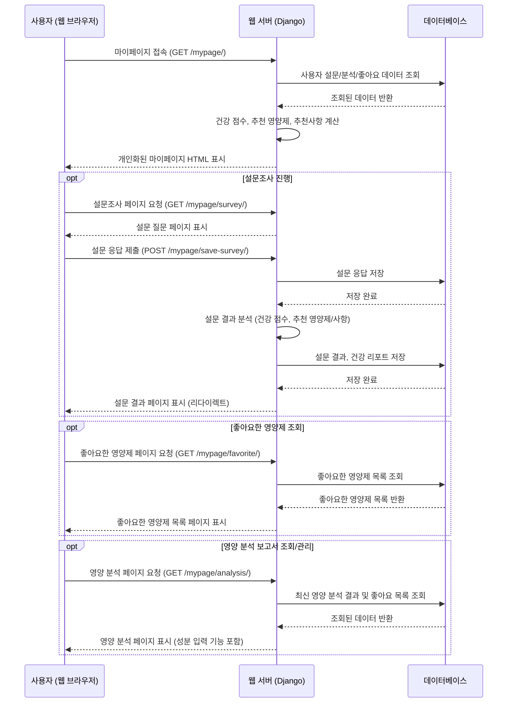

# Chapter 4: 마이페이지 개인화 기능

안녕하세요! `SKN10-FINAL-2Team` 프로젝트 튜토리얼의 네 번째 챕터에 오신 것을 환영합니다. [챕터 3: 사용자 계정 관리](03_사용자_계정_관리_.md)에서는 사용자가 우리 서비스에 안전하게 회원가입하고 로그인할 수 있는 방법을 배웠습니다. 이제 사용자가 서비스에 접속했을 때, 자신만의 특별한 공간을 제공하여 개인화된 경험을 할 수 있도록 돕는 것이 중요합니다. 바로 이곳이 `마이페이지`입니다.

## 1. '개인 건강 기록실': 마이페이지 개인화 기능은 왜 필요할까요?

여러분이 건강 관리를 시작하려고 할 때, 가장 먼저 무엇을 하고 싶으신가요? 아마도 자신의 현재 건강 상태를 파악하고, 어떤 영양소가 부족한지, 어떤 습관을 개선해야 하는지 알고 싶을 것입니다. 그리고 자신에게 맞는 영양제를 추천받고, 관심 있는 영양제 목록을 한눈에 보고 싶어 할 것입니다.

우리 서비스의 `마이페이지`는 바로 이러한 사용자들의 필요를 충족시키기 위해 존재합니다. 마치 사용자의 '개인 건강 기록실'이나 '개인 건강 비서'처럼, 사용자 개개인의 건강 데이터를 관리하고, 맞춤형 정보를 제공하는 공간입니다.

만약 마이페이지 개인화 기능이 없다면 어떤 문제가 생길까요?
*   사용자마다 다른 건강 상태나 생활 습관을 반영한 맞춤형 정보를 제공하기 어렵습니다.
*   자신이 어떤 영양제를 '좋아요' 했는지, 어떤 영양소 분석 보고서를 받았는지 한눈에 파악하기 어렵습니다.
*   서비스가 모든 사용자에게 동일한 정보를 제공하게 되어, 개인에게 특화된 유용성이 떨어집니다.

이러한 문제를 해결하기 위해 `마이페이지 개인화 기능`이 필요합니다. 이 기능은 사용자가 자신의 건강 데이터를 입력하고, 이를 바탕으로 개인 맞춤형 영양 분석 보고서를 생성하며, 관심 있는 영양제 목록을 관리할 수 있도록 돕습니다.

**주요 기능:**
*   **건강 설문조사:** 사용자의 생활 습관과 건강 상태를 파악합니다.
*   **영양 분석 보고서:** 설문조사 결과와 추가 데이터를 바탕으로 개인 맞춤형 영양 분석 보고서를 제공합니다.
*   **좋아요한 영양제 목록:** 사용자가 관심 있다고 표시한 영양제를 보여줍니다.
*   **사용자 건강 점수 및 추천사항:** 설문 결과와 분석을 통해 개인화된 건강 점수와 개선 사항을 제안합니다.

이번 챕터에서는 사용자가 마이페이지를 통해 자신의 건강 정보를 관리하고, 맞춤형 정보를 제공받는 과정을 중심으로 이 기능의 핵심을 살펴보겠습니다.

## 2. 마이페이지, 무엇을 개인화하나요?

마이페이지 개인화 기능을 구현하기 위해 우리는 사용자의 다양한 건강 관련 정보를 체계적으로 저장해야 합니다. `django-server\Mypage\models.py` 파일에 정의된 여러 모델들이 이 역할을 담당합니다.

**`django-server\Mypage\models.py`** 파일의 일부를 살펴볼까요?

```python
# django-server\Mypage\models.py
from django.db import models
from django.conf import settings
from Product.models import Products

class SurveyResponse(models.Model): # 설문 응답을 저장
    user = models.ForeignKey(settings.AUTH_USER_MODEL, on_delete=models.CASCADE)
    responses = models.JSONField(default=dict) # 모든 설문 질문과 응답 원본
    answers = models.JSONField(default=dict) # 처리된 답변 (주요 생활 습관 등)
    # ... (생략: 키, 몸무게, 생활 습관 등 추가 정보) ...

class SurveyResult(models.Model): # 설문 결과를 종합하여 저장
    user = models.ForeignKey(settings.AUTH_USER_MODEL, on_delete=models.CASCADE)
    answers = models.JSONField(default=dict) # 주요 답변 요약
    health_status = models.CharField(max_length=100, null=True, blank=True)
    # ... (생략: 추천 영양제 목록 등) ...

class UserHealthReport(models.Model): # 설문 결과를 바탕으로 한 건강 리포트
    user = models.ForeignKey(settings.AUTH_USER_MODEL, on_delete=models.CASCADE)
    survey_result = models.ForeignKey(SurveyResult, on_delete=models.CASCADE)
    health_score = models.IntegerField() # 계산된 건강 점수
    recommendations = models.TextField() # 건강 개선 추천사항

class NutrientAnalysis(models.Model): # 영양소 분석 결과
    user = models.ForeignKey(settings.AUTH_USER_MODEL, on_delete=models.CASCADE)
    date = models.DateField()
    total_nutrients = models.JSONField(default=dict) # 총 섭취 영양소 데이터
    analysis_result = models.TextField() # 분석 결과 텍스트
    overall_score = models.IntegerField() # 전체 영양 상태 점수

class Like(models.Model): # 사용자가 좋아요한 영양제
    user = models.ForeignKey(settings.AUTH_USER_MODEL, on_delete=models.CASCADE)
    product = models.ForeignKey(Products, on_delete=models.CASCADE) # 좋아요한 영양제 상품
    created_at = models.DateTimeField(auto_now_add=True)
    class Meta:
        unique_together = ('user', 'product') # 중복 좋아요 방지

class UserLog(models.Model): # 사용자 활동 로그 (클릭, 구매 등)
    user = models.ForeignKey(settings.AUTH_USER_MODEL, on_delete=models.CASCADE)
    product = models.ForeignKey(Products, on_delete=models.CASCADE)
    action = models.CharField(max_length=10) # 'click', 'purchase' 등
    timestamp = models.DateTimeField(auto_now_add=True)
```

위 코드는 `Mypage` 앱에서 사용되는 주요 모델들을 보여줍니다.
*   `SurveyResponse`와 `SurveyResult`는 사용자의 설문 응답 및 그 결과를 저장합니다.
*   `UserHealthReport`는 설문 결과를 바탕으로 생성되는 사용자의 건강 점수와 맞춤형 추천 사항을 담습니다.
*   `NutrientAnalysis`는 사용자의 영양 섭취 패턴을 분석한 결과를 저장합니다.
*   `Like` 모델은 사용자가 '좋아요'한 영양제 상품을 기록합니다.
*   `UserLog`는 사용자가 특정 영양제 상품을 클릭하거나 구매하는 등의 활동을 기록하여, 추후 맞춤형 추천에 활용될 수 있습니다.

이러한 모델들은 사용자의 개인화된 건강 데이터를 안전하게 저장하고, 이를 바탕으로 다양한 맞춤형 서비스를 제공하는 데 필수적인 '데이터 저장소' 역할을 합니다.

## 3. 개인화된 마이페이지 사용 흐름 살펴보기

사용자가 마이페이지에 접속하여 자신의 건강 정보를 확인하고 개인화된 서비스를 이용하는 흐름은 다음과 같습니다.



이 다이어그램은 사용자가 마이페이지에 접속했을 때부터 설문조사, 영양 분석, 좋아요 목록 조회 등 다양한 개인화 기능을 어떻게 이용하는지 보여줍니다. 각 기능은 백엔드(Django 웹 서버)와 데이터베이스 간의 긴밀한 상호작용을 통해 구현됩니다.

## 4. 마이페이지 기능 구현 상세

이제 위에서 살펴본 흐름을 바탕으로 실제 코드가 어떻게 동작하는지 더 자세히 알아보겠습니다.

### 4.1. 마이페이지 대시보드 표시: `mypage_view`

사용자가 `마이페이지` 메뉴를 클릭하면 `django-server\Mypage\views.py` 파일의 `mypage_view` 함수가 실행됩니다. 이 함수는 사용자의 가장 최근 설문 결과와 건강 리포트 등을 가져와 화면에 표시합니다.

**`django-server\Mypage\views.py`** 파일의 `mypage_view` 함수 일부:

```python
# django-server\Mypage\views.py
from django.shortcuts import render, redirect
from .models import SurveyResult, UserHealthReport
from django.contrib.auth.decorators import login_required

@login_required # 로그인된 사용자만 접근 가능
def mypage_view(request):
    # 사용자의 최근 설문 결과 가져오기
    latest_survey = SurveyResult.objects.filter(user=request.user).order_by('-created_at').first()
    
    if latest_survey:
        # 건강 점수 계산 (아래에서 자세히 설명)
        health_score = calculate_health_score(latest_survey)
        
        # 건강 리포트 생성 또는 업데이트
        health_report, created = UserHealthReport.objects.get_or_create(
            user=request.user,
            survey_result=latest_survey,
            defaults={
                'health_score': health_score,
                'recommendations': generate_recommendations(latest_survey, health_score)
            }
        )
        # ... (생략: 업데이트 로직 및 추천 영양제 가져오기) ...
        context = {
            'latest_survey': latest_survey,
            'health_score': health_score,
            'recommendations': health_report.recommendations.split('\n'),
            'survey_history': survey_history # 설문 이력
        }
    else: # 설문 기록이 없는 경우
        context = { 'latest_survey': None, 'health_score': 0 }
    
    context['user'] = request.user
    return render(request, 'Mypage/mypage.html', context)
```

이 코드를 간단히 설명하자면:
1.  `@login_required` 데코레이터를 통해 로그인된 사용자만 이 페이지에 접근할 수 있도록 합니다.
2.  `SurveyResult.objects.filter(user=request.user).order_by('-created_at').first()`를 사용하여 현재 로그인한 사용자의 가장 최근 설문 결과를 데이터베이스에서 가져옵니다.
3.  `calculate_health_score`와 `generate_recommendations` 함수(이 함수들은 뒤에서 더 자세히 설명합니다)를 호출하여 사용자의 건강 점수와 맞춤형 추천사항을 계산합니다.
4.  계산된 점수와 추천사항을 `UserHealthReport` 모델에 저장하거나 업데이트합니다.
5.  모든 데이터를 `context` 딕셔너리에 담아 `Mypage/mypage.html` 템플릿으로 전달하여 화면에 표시합니다.

**`django-server\templates\Mypage\mypage.html`** 의 일부:

```html
{# django-server\templates\Mypage\mypage.html #}
<div class="mypage-container">
    <div class="mypage-header">
        <h1>마이페이지</h1>
        <p>안녕하세요, {{ user.name }}님!</p> {# 로그인한 사용자의 이름을 표시 #}
    </div>

    <!-- 건강 점수 섹션 -->
    <div class="health-score-section">
        <h2>나의 건강 점수</h2>
        
            <div class="score-circle">
                <span class="score">{{ health_score }}</span> {# 계산된 건강 점수 표시 #}
                <span class="score-label">점</span>
            </div>
        
            <p>아직 설문을 진행하지 않았습니다.</p>
            <a href="" class="btn-primary">설문하러 가기</a>
        
    </div>

    <!-- 건강 추천사항 섹션 -->
    <div class="health-recommendations-section">
        <h2>건강 추천사항</h2>
        
            <div class="recommendations">
                {{ recommendations|linebreaks }} {# 계산된 추천사항 표시 #}
            </div>
        
            <p>아직 추천사항이 없습니다.</p>
        
    </div>
    {# ... (추천 영양제, 설문 이력 등 다른 섹션 생략) ... #}
</div>
```

이 HTML 코드는 `views.py`에서 전달받은 `user.name`, `health_score`, `recommendations` 등의 데이터를 사용하여 사용자에게 개인화된 정보를 보여줍니다. `` 태그를 사용하여 데이터가 있을 때만 해당 내용을 표시하도록 합니다.

### 4.2. 건강 설문조사: `survey_view`와 `save_survey`

사용자의 건강 상태와 생활 습관을 파악하는 첫 단계는 설문조사입니다.

1.  **설문조사 페이지 표시 (`survey_view`):**
    `django-server\Mypage\views.py`의 `survey_view` 함수는 `survey_questions.json` 파일에서 설문 질문 목록을 불러와 사용자에게 보여줍니다.

    ```python
    # django-server\Mypage\views.py (일부)
    import json
    import os
    from django.conf import settings

    @login_required
    def survey_view(request):
        json_file_path = os.path.join(settings.STATICFILES_DIRS[0], 'json', 'Mypage', 'survey_questions.json')
        try:
            with open(json_file_path, 'r', encoding='utf-8') as f:
                survey_questions = json.load(f)
        except FileNotFoundError:
            survey_questions = {'questions': []} # 파일이 없으면 빈 목록
        # ... (생략: 기타 에러 처리) ...
        
        context = {
            'user': request.user,
            'survey_questions': survey_questions,
        }
        return render(request, 'Mypage/survey.html', context)
    ```

    이 코드는 `STATICFILES_DIRS`에 설정된 경로에서 `survey_questions.json` 파일을 찾아 읽어옵니다. 이 JSON 파일에는 설문의 각 질문, 질문 유형(선택형, 숫자 입력형), 선택지 등이 정의되어 있습니다.

    **`django-server\templates\Mypage\survey.html`** 의 일부:

    ```html
    {# django-server\templates\Mypage\survey.html #}
    <div class="survey-container">
        <div class="initial-survey-page">
            <h1 class="survey-title">건강 설문조사</h1>
            <button type="button" class="start-survey-btn" id="startButton">시작하기</button>
        </div>

        <form method="post" action="" class="survey-form" style="display: none;">
            
            
                
                <div class="question-group" style="display: none;">
                    <h2>{{ question.text }}</h2> {# JSON 파일에서 가져온 질문 텍스트 #}
                    
                    <input type="hidden" name="{{ question.name }}" value="" required>
                    <div class="option-row">
                        
                        <div class="option-box" data-value="{{ option }}" data-input="{{ question.name }}"><span>{{ option }}</span></div>
                        
                    </div>
                    
                    <input type="number" name="{{ question.name }}" placeholder="숫자 입력" required min="1">
                    
                    {# ... (버튼 생략) ... #}
                </div>
                
            
                <div class="error-message"><p>설문 질문을 불러오는 중 오류가 발생했습니다.</p></div>
            
        </form>
    </div>
    ```

    이 HTML은 Django 템플릿 태그를 사용하여 `survey_questions`에서 가져온 질문들을 동적으로 표시합니다. `question.type`에 따라 선택형(`select`) 또는 숫자 입력형(`number`)으로 다르게 렌더링됩니다.

2.  **설문 응답 저장 (`save_survey`):**
    사용자가 설문조사를 완료하고 '제출하기' 버튼을 누르면, `django-server\Mypage\views.py`의 `save_survey` 함수가 호출됩니다.

    ```python
    # django-server\Mypage\views.py (일부)
    @login_required
    def save_survey(request):
        if request.method == 'POST':
            try:
                # POST 데이터에서 설문 응답을 가져옵니다.
                height = float(request.POST.get('height', 0))
                weight = float(request.POST.get('weight', 0))
                sitting_work = request.POST.get('sitting_work', '')
                # ... (생략: 다른 응답들) ...

                # SurveyResponse 객체 생성 및 저장
                survey_response = SurveyResponse.objects.create(
                    user=request.user,
                    # ... (모든 응답 필드 저장) ...
                    height=height,
                    weight=weight,
                    sitting_work=sitting_work,
                )

                # SurveyResult 객체 생성 및 저장 (요약된 결과)
                survey_result = SurveyResult.objects.create(
                    user=request.user,
                    answers={ # answers 필드에 요약된 정보를 JSON 형태로 저장
                        'height': height,
                        'weight': weight,
                        'sitting_work': sitting_work,
                        # ... (다른 응답들) ...
                    }
                )
                print(f"설문 응답 및 결과가 저장되었습니다: {survey_result.id}")
                return redirect('mypage:survey_result') # 결과 페이지로 이동
            except Exception as e:
                print(f"설문 응답 저장 중 오류 발생: {str(e)}")
                return JsonResponse({'status': 'error', 'message': '저장 오류'}, status=500)
        return redirect('mypage:survey') # POST 요청이 아니면 설문 페이지로 리다이렉트
    ```

    이 코드는 사용자가 제출한 설문 응답 데이터(`request.POST`에서 가져옴)를 `SurveyResponse`와 `SurveyResult` 모델에 저장합니다. `SurveyResult` 모델의 `answers` 필드에는 설문의 주요 응답들이 JSON 형태로 저장되어, 나중에 쉽게 접근하고 분석할 수 있도록 합니다. 저장이 완료되면 `survey_result` 페이지로 사용자를 리다이렉트합니다.

### 4.3. 설문 결과 및 건강 리포트: `survey_result`

설문조사가 저장되면, 사용자는 자신의 건강 점수와 맞춤형 추천 사항이 담긴 보고서를 볼 수 있습니다. `django-server\Mypage\views.py`의 `survey_result` 함수가 이 역할을 합니다.

**`django-server\Mypage\views.py`** 파일의 `survey_result` 함수 일부:

```python
# django-server\Mypage\views.py (일부)
@login_required
def survey_result(request):
    try:
        # 가장 최근 설문 결과 가져오기
        survey_result = SurveyResult.objects.filter(user=request.user).latest('created_at')
        
        # 건강 점수 계산
        health_score = calculate_health_score(survey_result)
        
        # 추천 영양제 가져오기
        recommended_supplements = get_recommended_supplements(survey_result)
        
        # 건강 리포트 생성 또는 업데이트
        health_report, created = UserHealthReport.objects.get_or_create(
            user=request.user,
            survey_result=survey_result,
            defaults={
                'health_score': health_score,
                'recommendations': generate_recommendations(survey_result, health_score)
            }
        )
        # ... (생략: 업데이트 로직) ...
        
        context = {
            'survey_result': survey_result,
            'health_score': health_score,
            'recommended_supplements': recommended_supplements,
            'recommendations': health_report.recommendations.split('\n')
        }
        return render(request, 'Mypage/survey_result.html', context)
    except SurveyResult.DoesNotExist:
        return render(request, 'Mypage/survey_result.html', {
            'message': '설문 응답이 없습니다. 먼저 설문을 완료해주세요.'
        })
    except Exception as e:
        print(f"survey_result 뷰 오류: {str(e)}")
        return render(request, 'Mypage/survey_result.html', {
            'message': '설문 결과를 불러오는 중 오류가 발생했습니다.'
        })

# --- 도우미 함수들 ---
def calculate_health_score(survey_result):
    score = 100 # 초기 점수는 100점
    answers = survey_result.answers # 설문 응답에서 답변 가져오기

    # 예시: 수면 시간 감점 로직
    sleep_hours = answers.get('sleep_hours')
    if sleep_hours and float(sleep_hours) < 7:
        score -= 10
    
    # 예시: 운동 빈도 감점 로직
    exercise_frequency = answers.get('exercise_frequency')
    if exercise_frequency in ['전혀 안함', '1-2회']:
        score -= 15
    
    # ... (생략: 다른 감점 로직) ...

    return max(0, score) # 점수가 0점 미만이 되지 않도록

def get_recommended_supplements(survey_result):
    supplements = []
    # 예시: 비타민 D 추천 조건
    if survey_result.answers.get('indoor_daytime') == '항상': # 실내 활동이 많으면 비타민 D 추천
        supplements.append({
            'name': '비타민 D',
            'reason': '실내 생활이 많고 햇빛 노출이 부족합니다.',
            'benefits': '면역력 강화와 뼈 건강에 도움을 줍니다.'
        })
    # ... (생략: 다른 영양제 추천 조건) ...
    return supplements

def generate_recommendations(survey_result, health_score):
    recommendations = []
    answers = survey_result.answers
    
    # 예시: 수면 관련 추천
    sleep_hours = answers.get('sleep_hours')
    if sleep_hours and float(sleep_hours) < 7:
        recommendations.append("수면 시간을 7시간 이상으로 늘리는 것을 권장합니다.")
    
    # ... (생략: 다른 생활 습관 추천) ...

    return '\n'.join(recommendations) # 여러 추천 사항을 한 줄씩 구분하여 반환
```

이 코드를 간단히 설명하자면:
1.  가장 최근 설문 결과(`SurveyResult`)를 가져옵니다.
2.  `calculate_health_score` 함수를 호출하여 설문 답변을 바탕으로 사용자의 건강 점수(100점 만점)를 계산합니다. 이 함수는 수면 시간, 운동 빈도, 흡연 여부 등 다양한 답변에 따라 점수를 감점하는 방식으로 작동합니다.
3.  `get_recommended_supplements` 함수는 설문 답변을 분석하여 사용자에게 필요한 영양제(예: 실내 활동이 많으면 비타민 D)를 추천합니다.
4.  `generate_recommendations` 함수는 사용자의 생활 습관 개선을 위한 구체적인 제안(예: "수면 시간을 7시간 이상으로 늘리는 것을 권장합니다.")을 생성합니다.
5.  계산된 점수, 추천 영양제, 추천 사항은 `UserHealthReport` 모델에 저장되어 사용자의 건강 이력으로 관리됩니다.
6.  이 모든 정보는 `Mypage/survey_result.html` 템플릿으로 전달되어 사용자에게 보기 좋게 표시됩니다.

**`django-server\templates\Mypage\survey_result.html`** 의 일부:

```html
{# django-server\templates\Mypage\survey_result.html #}
<div class="survey-result-container">
    <h1 class="result-title">설문 결과</h1>
    
    <div class="health-status">
        <h2>현재 건강 상태</h2>
        <p>건강 점수: {{ health_score }}점</p> {# 계산된 건강 점수 #}
        <p>건강 상태: {{ survey_result.answers.health_status }}</p> {# 설문에서 입력된 건강 상태 #}
    </div>

    <div class="supplements-section">
        <h2>추천 영양제</h2>
        
        <div class="supplement-card">
            <h3>{{ supplement.name }}</h3>
            <p><strong>추천 이유:</strong> {{ supplement.reason }}</p>
            <p><strong>효과:</strong> {{ supplement.benefits }}</p>
        </div>
        
    </div>

    <div class="lifestyle-section">
        <h2>생활 습관 개선 제안</h2>
        <ul class="lifestyle-list">
            
            <li>{{ recommendation }}</li> {# 생성된 생활 습관 개선 제안 #}
            
        </ul>
    </div>
    {# ... (설문 응답 요약 등 다른 섹션 생략) ... #}
    <button class="profile-btn" onclick="window.location.href=''">마이페이지로 이동</button>
</div>
```

이 HTML 코드는 `views.py`에서 전달받은 `health_score`, `recommended_supplements`, `recommendations` 등의 데이터를 사용하여 사용자에게 설문 결과를 시각적으로 보여줍니다.

### 4.4. 좋아요한 영양제 목록 관리: `like_list` 및 `like_api`

사용자들이 관심 있는 영양제를 편리하게 관리할 수 있도록 '좋아요' 기능과 목록 조회 기능을 제공합니다.

1.  **좋아요한 영양제 목록 표시 (`like_list`):**
    `django-server\Mypage\views.py`의 `like_list` 함수는 현재 로그인한 사용자가 '좋아요'한 모든 영양제 목록을 가져와 화면에 표시합니다.

    ```python
    # django-server\Mypage\views.py (일부)
    from .models import Like
    from Product.models import Products # Products 모델 불러오기
    from django.contrib.auth import get_user_model

    @login_required
    def like_list(request):
        user = request.user # 현재 로그인한 사용자 객체
        like_list = Like.objects.filter(user=user).select_related('product') # 좋아요 목록 조회
        return render(request, 'Mypage/like.html', {'user': user, 'like_list': like_list})

    @require_POST
    @login_required
    def like_add(request):
        product_id = request.POST.get('product_id')
        user = request.user
        try:
            product = Products.objects.get(pk=product_id)
            Like.objects.get_or_create(user=user, product_id=product_id) # 좋아요 추가 (중복 방지)
            # ... (생략: 사용자 로그 기록) ...
            return JsonResponse({'success': True})
        except Exception as e:
            return JsonResponse({'success': False, 'error': str(e)}, status=400)

    @require_POST
    @login_required
    def like_delete(request):
        product_id = request.POST.get('product_id')
        user = request.user
        try:
            like = Like.objects.get(user=user, product_id=product_id)
            like.delete() # 좋아요 삭제
            # ... (생략: 사용자 로그 기록) ...
            return JsonResponse({'success': True})
        except Like.DoesNotExist:
            return JsonResponse({'success': False, 'error': '좋아요를 찾을 수 없습니다.'}, status=404)
    ```

    이 코드를 간단히 설명하자면:
    *   `like_list`는 `Like` 모델을 사용하여 현재 사용자와 연결된 모든 '좋아요' 기록을 가져옵니다. `select_related('product')`는 관련된 `Products` 정보도 함께 가져와 데이터베이스 쿼리를 최적화합니다.
    *   `like_add`는 `product_id`를 받아 해당 상품에 '좋아요'를 추가합니다. `get_or_create`를 사용하여 이미 좋아요가 되어 있다면 새로 생성하지 않습니다.
    *   `like_delete`는 `product_id`를 받아 해당 상품의 '좋아요'를 삭제합니다.

2.  **좋아요 상태 토글 및 API 연동 (`like_api`, `toggle_like`):**
    사용자가 상품 상세 페이지나 목록에서 '좋아요' 버튼을 클릭하면, 이 상태를 백엔드에 업데이트해야 합니다. `like_api` (또는 `toggle_like`) 함수가 이 역할을 합니다. (참고: 프로젝트 코드에는 `Like` 모델과 `Favorite` 모델이 모두 '좋아요' 관련으로 사용되고 있습니다. 여기서는 `Like` 모델을 중심으로 설명하며, `like_api`는 범용적으로 사용될 수 있는 API입니다.)

    ```python
    # django-server\Mypage\views.py (일부)
    from django.views.decorators.csrf import csrf_exempt
    from django.views.decorators.http import require_http_methods
    
    @csrf_exempt # CSRF 보호를 임시 해제 (API 특성상)
    @require_http_methods(["POST", "DELETE", "GET"]) # POST, DELETE, GET 메서드만 허용
    @login_required
    def like_api(request):
        user_id = request.user.id # 현재 로그인한 사용자 ID

        if request.method == "GET": # 상품의 좋아요 상태 확인
            product_id = request.GET.get('product_id')
            product = get_object_or_404(Products, id=product_id)
            is_liked = Like.objects.filter(user_id=user_id, product=product).exists()
            return JsonResponse({"is_liked": is_liked})
            
        elif request.method == "POST": # 좋아요 추가
            data = json.loads(request.body)
            product_id = data.get('product_id')
            product = get_object_or_404(Products, id=product_id)
            like, created = Like.objects.get_or_create(user=request.user, product=product)
            return JsonResponse({"message": "좋아요 추가됨" if created else "이미 좋아요됨", "is_liked": True})
            
        elif request.method == "DELETE": # 좋아요 제거
            data = json.loads(request.body)
            product_id = data.get('product_id')
            product = get_object_or_404(Products, id=product_id)
            like = Like.objects.filter(user=request.user, product=product)
            if like.exists():
                like.delete()
                return JsonResponse({"message": "좋아요 제거됨", "is_liked": False})
            else:
                return JsonResponse({"message": "좋아요 아님", "is_liked": False})
        
        return JsonResponse({"error": "지원하지 않는 메서드"}, status=405)
    ```

    이 코드를 간단히 설명하자면:
    *   `like_api`는 `GET`, `POST`, `DELETE` HTTP 메서드를 지원합니다.
    *   `GET` 요청은 특정 `product_id`에 대해 사용자가 '좋아요'했는지 여부를 반환합니다.
    *   `POST` 요청은 해당 상품에 '좋아요'를 추가하고, `DELETE` 요청은 '좋아요'를 제거합니다. 이 API는 상품 상세 페이지 등에서 '좋아요' 버튼의 상태를 실시간으로 업데이트하는 데 사용될 수 있습니다.

**`django-server\templates\Mypage\like.html`** 의 일부 (JavaScript 포함):

```html
{# django-server\templates\Mypage\like.html #}
<body>
    <div class="center-container">
        <div class="h2">
            <span style="color: #DDC66F;">{{ user.first_name }}</span> <span>님이 좋아요 누른 영양제</span>
        </div>
        <div class="like-list-container">
            
                
                <div class="like-item" data-product-id="{{ like.product.id }}">
                    <div class="product-container">
                        
                        <div class="item-info">
                            <div class="body-font">{{ like.product.title }}</div>
                            <div class="caption-font">{{ like.product.brand }}</div>
                            <div class="body-font">$ {{ like.product.total_price }}</div>
                            <div class="caption-font">★ {{ like.product.average_rating }} ({{ like.product.total_reviews }})</div>
                        </div>
                        <button class="heart-btn liked" title="Dislike">&#10084;</button>
                    </div>
                </div>
            
            
                <div class="h3">좋아요 누른 영양제가 없어요.</div>
            
        </div>
    </div>
    <script>
    document.querySelectorAll('.heart-btn').forEach(function(btn) {
        btn.addEventListener('click', function() {
            const likeItem = btn.closest('.like-item');
            const productId = likeItem.dataset.productId;
            const isLiked = btn.classList.contains('liked');
            // '좋아요' 상태에 따라 다른 URL 호출
            const url = isLiked ? "" : "";

            fetch(url, {
                method: "POST",
                headers: {
                    "X-CSRFToken": "{{ csrf_token }}", // Django 보안을 위한 CSRF 토큰
                    "Content-Type": "application/x-www-form-urlencoded"
                },
                body: "product_id=" + encodeURIComponent(productId) // 상품 ID 전송
            })
            .then(res => res.json())
            .then(data => {
                if (data.success) {
                    if (isLiked) { // 현재 좋아요 상태였으면 -> 좋아요 취소
                        btn.classList.remove('liked');
                        btn.innerHTML = "&#9825;"; // 빈 하트 표시
                    } else { // 현재 좋아요 상태가 아니었으면 -> 좋아요 추가
                        btn.classList.add('liked');
                        btn.innerHTML = "&#10084;"; // 채운 하트 표시
                    }
                    // 페이지 새로고침 또는 목록에서 해당 항목 제거 등 추가 UI 업데이트 필요
                } else {
                    alert("처리 실패: " + (data.error || "알 수 없는 오류"));
                }
            });
        });
    });
    </script>
</body>
```

이 HTML과 JavaScript 코드는 다음과 같이 작동합니다.
*   Django 템플릿 태그를 사용하여 `like_list`에 있는 각 영양제 상품의 정보를 반복하여 화면에 표시합니다.
*   각 상품 옆에는 '하트' 버튼이 있습니다. 이 버튼을 클릭하면 `click` 이벤트가 발생합니다.
*   JavaScript는 클릭된 상품의 `product_id`와 현재 '좋아요' 상태를 확인합니다.
*   `fetch` API를 사용하여 `/mypage/like_delete/` (좋아요 취소) 또는 `/mypage/like_add/` (좋아요 추가) URL로 `POST` 요청을 보냅니다. 이때 Django의 보안을 위해 `CSRFToken`을 헤더에 포함합니다.
*   요청이 성공하면, 버튼의 클래스와 하트 아이콘을 변경하여 사용자에게 '좋아요' 상태가 변경되었음을 시각적으로 알려줍니다.

### 4.5. 영양 분석 보고서: `analysis_view` 및 관련 기능

마이페이지는 단순한 설문 결과 외에, 사용자가 직접 영양제 성분표 이미지를 업로드하거나 수동으로 영양소 섭취량을 입력하여 보다 상세한 영양 분석을 받을 수 있는 기능도 제공합니다.

`django-server\Mypage\views.py`의 `analysis_view` 함수는 영양 분석 페이지를 렌더링하며, 사용자의 최신 분석 결과와 좋아요한 영양제 목록을 함께 보여줍니다.

```python
# django-server\Mypage\views.py (일부)
@login_required
def analysis_view(request):
    try:
        # 사용자의 최신 영양소 분석 결과 가져오기
        latest_analysis = NutrientAnalysis.objects.filter(user=request.user).order_by('-date').first()
        
        # 사용자가 좋아요한 영양제 가져오기
        likes = Like.objects.filter(user=request.user).select_related('product')
        liked_supplements = [like.product for like in likes]

        # ... (생략: 추천 영양제 가져오기) ...
        
        # 영양소 기준치 데이터 로드 (분석에 활용)
        json_path = os.path.join(settings.STATICFILES_DIRS[0], 'json', 'Mypage', 'nutrient_standards.json')
        try:
            with open(json_path, 'r', encoding='utf-8') as f:
                nutrient_standards = json.load(f)
        except Exception as e:
            nutrient_standards = {} # 파일 로드 실패 시 빈 딕셔너리
            print(f"영양소 기준치 파일 로드 실패: {str(e)}")
        
        context = {
            'latest_analysis': latest_analysis,
            'nutrient_standards': nutrient_standards,
            'liked_supplements': liked_supplements,
            # ... (생략: 추천 영양제) ...
        }
        return render(request, 'Mypage/analysis.html', context)
    except Exception as e:
        messages.error(request, f'영양소 분석 결과를 불러오는 중 오류가 발생했습니다: {str(e)}')
        return redirect('mypage')
```

이 코드는 `NutrientAnalysis` 모델에서 최신 분석 결과를 가져오고, `Like` 모델에서 사용자가 좋아요한 영양제 목록을 가져옵니다. 또한 `nutrient_standards.json` 파일에서 영양소별 일일 권장 섭취량 같은 기준 데이터를 로드하여 분석에 활용합니다. 이 모든 데이터는 `Mypage/analysis.html` 템플릿으로 전달됩니다.

**`django-server\templates\Mypage\analysis.html`** 의 일부:

```html
{# django-server\templates\Mypage\analysis.html #}

<div class="my_healthy">
    <div class="card-row-flex">
        <!-- 왼쪽 카드: 영양제 추가하기 (입력 방식 선택) -->
        <div class="card-box left-card">
            <div class="title">영양제 추가하기</div>
            <input type="file" id="ocr-upload" accept="image/*" style="display:none" onchange="handleOcrUpload(event)">
            <div class="upload-box" onclick="document.getElementById('ocr-upload').click()">
                <span>이미지 업로드하기</span> {# OCR 기능 활용 #}
            </div>
            <div class="upload-box" onclick="loadFavoriteProducts()">
                <span>좋아요한 영양제 불러오기</span> {# 좋아요한 상품에서 성분 정보 가져오기 #}
            </div>
            <div class="upload-box" onclick="showManualInput()">
                <span>직접 입력하기</span> {# 수동으로 영양소 정보 입력 #}
            </div>
            <div id="product-details" class="product-details">
                <!-- OCR 결과 또는 선택된 상품의 성분 정보가 여기에 표시됩니다. -->
            </div>
        </div>

        <!-- 오른쪽 카드: 영양분석 결과 표시 -->
        <div class="card-box right-card">
            <div class="title">{{ user.username }}님의 영양분석</div>
            <div class="result-content">
                <h2>권장섭취량 대비 섭취량 분석</h2>
                <div class="nutrition-item">
                    <span class="nutrition-label">단백질</span>
                    <div class="nutrition-bar"><div class="nutrition-bar-fill" style="width: 80%"></div></div>
                    <span class="nutrition-percent">80%</span>
                </div>
                {# ... (다른 영양소 항목 생략) ... #}
            </div>
        </div>
    </div>
</div>

<!-- 좋아요한 영양제 모달 -->
<div id="favoriteModal" class="modal">
    <div class="modal-content">
        <h2>좋아요한 영양제</h2>
        <div id="favorite-products" class="favorite-products-grid"></div> {# 좋아요한 상품 목록이 여기에 동적으로 로드 #}
    </div>
</div>

<!-- 직접 입력 모달 -->
<div id="manualInputModal" class="modal">
    <div class="modal-content">
        <h2>영양소 직접 입력</h2>
        <div><label>단백질 (%)</label><input type="number" id="proteinInput" min="0" max="100"></div>
        {# ... (다른 영양소 입력 필드 생략) ... #}
        <button onclick="saveManualInput()">저장</button>
    </div>
</div>



<script>
// CSRF 토큰 가져오기 함수 (보안을 위해 필요)
function getCookie(name) { /* ... */ }

// 이미지 업로드 (OCR) 처리 함수
function handleOcrUpload(event) {
    const file = event.target.files[0];
    if (!file) return;
    const formData = new FormData();
    formData.append('image', file);
    fetch('/mypage/ocr_extract/', { // OCR API 호출
        method: 'POST',
        headers: { 'X-CSRFToken': getCookie('csrftoken') },
        body: formData
    })
    .then(response => response.json())
    .then(data => {
        if (data.status === 'success') {
            showProductDetails({ingredients: data.ingredients}); // 인식된 성분 표시
        } else {
            document.getElementById('ocr-error').innerText = data.message || '성분 인식 실패';
        }
    })
    .catch((err) => { console.error('OCR 오류:', err); });
}

// 좋아요한 영양제 불러오기
function loadFavoriteProducts() {
    fetch('/mypage/get_favorite_products/') // 좋아요한 상품 API 호출
        .then(response => response.json())
        .then(data => {
            if (data.status === 'success') {
                const favoriteProductsGrid = document.getElementById('favorite-products');
                favoriteProductsGrid.innerHTML = '';
                data.data.forEach(product => { // 응답 데이터의 'data' 필드 사용
                    // 각 상품 카드를 생성하여 그리드에 추가
                    const productCard = document.createElement('div');
                    productCard.className = 'favorite-product-card';
                    productCard.innerHTML = `
                        
                        <h3>${product.title}</h3>
                        <p>가격: $${product.price}</p>
                    `;
                    favoriteProductsGrid.appendChild(productCard);
                });
                document.getElementById("favoriteModal").style.display = "block"; // 모달 표시
            } else {
                alert('좋아요한 영양제를 불러오는데 실패했습니다.');
            }
        });
}

// 수동 입력 모달 표시 및 저장
function showManualInput() { document.getElementById('manualInputModal').classList.add('show'); }
function saveManualInput() { /* ... 입력값 저장 API 호출 로직 ... */ }
function closeModal(modalId) { document.getElementById(modalId).classList.remove('show'); }

// OCR 결과 성분 표시 함수
function showProductDetails(product) {
    const detailsDiv = document.getElementById('product-details');
    let html = '<h3>제품 성분</h3><ul>';
    for (const [key, value] of Object.entries(product.ingredients)) {
        html += `<li><strong>${key}</strong>: ${value}</li>`;
    }
    html += '</ul>';
    detailsDiv.innerHTML = html;
}
</script>

```

이 HTML과 JavaScript 코드는 다음과 같이 작동합니다.
*   사용자는 '이미지 업로드', '좋아요한 영양제 불러오기', '직접 입력하기' 세 가지 방식 중 하나를 선택하여 영양소 데이터를 입력할 수 있습니다.
*   '이미지 업로드'를 선택하면, `handleOcrUpload` 함수가 실행되어 이미지를 `ocr_extract` API (`django-server\Mypage\views.py`에 정의된 OCR 처리 함수)로 전송하고, 반환된 성분 정보를 `product-details` 영역에 표시합니다.
*   '좋아요한 영양제 불러오기'를 선택하면, `loadFavoriteProducts` 함수가 실행되어 `/mypage/get_favorite_products/` API를 호출하고, 사용자가 이전에 좋아요했던 상품들의 상세 정보를 가져와 모달(팝업)에 표시합니다.
*   '직접 입력하기'를 선택하면 `manualInputModal`이 나타나 사용자가 수동으로 영양소 비율을 입력할 수 있도록 합니다.
*   오른쪽 카드에는 사용자의 영양 분석 결과가 그래프 형태로 표시됩니다 (예시 HTML에는 정적인 데이터가 있지만, 실제로는 백엔드에서 받아온 데이터로 동적으로 채워집니다). `get_nutrient_data` API를 통해 영양소 데이터를 가져와 차트를 그릴 수 있습니다.

### 4.6. 사용자 활동 로그: `product_click`

마이페이지에서는 사용자가 특정 영양제 상품을 클릭했을 때 이 정보를 기록하여, 추후 맞춤형 추천 시스템에 활용할 수 있습니다.

```python
# django-server\Mypage\views.py (일부)
from .models import UserLog
from Product.models import Products

@require_POST
@login_required
def product_click(request):
    product_id = request.POST.get('product_id')
    user = request.user
    try:
        product = Products.objects.get(pk=product_id)
        # UserLog 모델에 'click' 액션으로 기록
        UserLog.objects.create(user=user, product=product, action='click')
        return JsonResponse({'success': True})
    except Exception as e:
        return JsonResponse({'success': False, 'error': str(e)}, status=400)
```

이 코드는 사용자가 상품 목록이나 상세 페이지에서 특정 상품을 클릭했을 때 호출됩니다. 클릭된 상품의 ID를 받아 `UserLog` 모델에 `click`이라는 `action`으로 기록합니다. 이렇게 쌓인 사용자 활동 데이터는 나중에 [챕터 5: 영양제 챗봇 시스템](05_영양제_챗봇_시스템_.md)에서 개인 맞춤형 추천을 제공하는 데 중요한 자료로 활용될 수 있습니다.

## 5. URL 매핑: `urls.py`

지금까지 설명한 모든 마이페이지 기능들은 `django-server\Mypage\urls.py` 파일을 통해 특정 웹 주소(URL)와 연결됩니다.

**`django-server\Mypage\urls.py`** 파일의 일부:

```python
# django-server\Mypage\urls.py
from django.urls import path
from . import views

app_name = 'mypage' # 앱 이름 공간 설정

urlpatterns = [
    path('', views.mypage_view, name='mypage'), # 마이페이지 대시보드
    path('survey/', views.survey_view, name='survey'), # 설문조사 페이지
    path('save-survey/', views.save_survey, name='save_survey'), # 설문 응답 저장 API
    path('survey-result/', views.survey_result, name='survey_result'), # 설문 결과 페이지
    path('favorite/', views.favorite_view, name='favorite'), # 좋아요한 영양제 목록 (별도 뷰)
    path('toggle-like/', views.toggle_like, name='toggle_like'), # 좋아요 상태 토글 (Favorite 모델 사용)
    path('analysis/', views.analysis_view, name='analysis'), # 영양 분석 페이지
    path('get_favorite_products/', views.get_favorite_products, name='get_favorite_products'), # 좋아요한 상품 API
    path('get_nutrient_data/', views.get_nutrient_data, name='get_nutrient_data'), # 영양소 데이터 API
    path('ocr_extract/', views.ocr_extract, name='ocr_extract'), # OCR 추출 API
    path('like/', views.like_list, name='like_list'), # 좋아요 목록 (Like 모델 사용)
    path('like/delete/', views.like_delete, name='like_delete'), # 좋아요 삭제 API
    path('like/add/', views.like_add, name='like_add'), # 좋아요 추가 API
    path('product/click/', views.product_click, name='product_click'), # 상품 클릭 로그 API
    path('chatbot/', views.chatbot_view, name='chatbot'), # 챗봇 페이지
    path('api/like/', views.like_api, name='like_api'), # 범용 좋아요 API
]
```

이 `urls.py` 파일은 각 기능에 해당하는 URL 패턴을 정의하고, 해당 URL로 요청이 들어왔을 때 어떤 `views.py` 함수가 실행되어야 할지 연결합니다. 예를 들어, `http://localhost:8000/mypage/survey/` 주소로 접속하면 `views.survey_view` 함수가 실행되어 설문조사 페이지를 보여주는 식입니다.

## 결론

이번 챕터에서는 사용자 개개인의 건강 데이터를 관리하고, 맞춤형 정보를 제공하는 `마이페이지 개인화 기능`에 대해 자세히 알아보았습니다. 사용자의 '개인 건강 기록실'이라는 비유를 통해 설문조사, 영양 분석 보고서, 좋아요한 영양제 목록, 건강 점수 및 추천사항 등 핵심 기능들을 이해할 수 있었습니다.

특히, `Mypage` 앱의 다양한 모델(`SurveyResponse`, `SurveyResult`, `UserHealthReport`, `NutrientAnalysis`, `Like`, `UserLog`)이 어떻게 사용자 데이터를 체계적으로 저장하는지, 그리고 `views.py`의 함수들이 이 데이터를 활용하여 개인화된 정보를 생성하고 화면에 표시하는 과정을 살펴보았습니다. 프론트엔드(`HTML 템플릿`, `JavaScript`)와 백엔드(`Django 모델`, `뷰`, `URL`)가 어떻게 상호작용하는지 이해하는 것이 중요합니다.

이제 우리는 사용자가 자신의 건강을 관리하고 맞춤형 정보를 얻을 수 있는 강력한 개인화된 공간을 제공할 수 있게 되었습니다. 다음 챕터에서는 이러한 개인화된 데이터를 바탕으로 사용자에게 더 유용한 영양제 정보를 제공하는 `영양제 챗봇 시스템`에 대해 알아보겠습니다.

[챕터 5: 영양제 챗봇 시스템](05_영양제_챗봇_시스템_.md)

---

Generated by [AI Codebase Knowledge Builder](https://github.com/The-Pocket/Tutorial-Codebase-Knowledge)