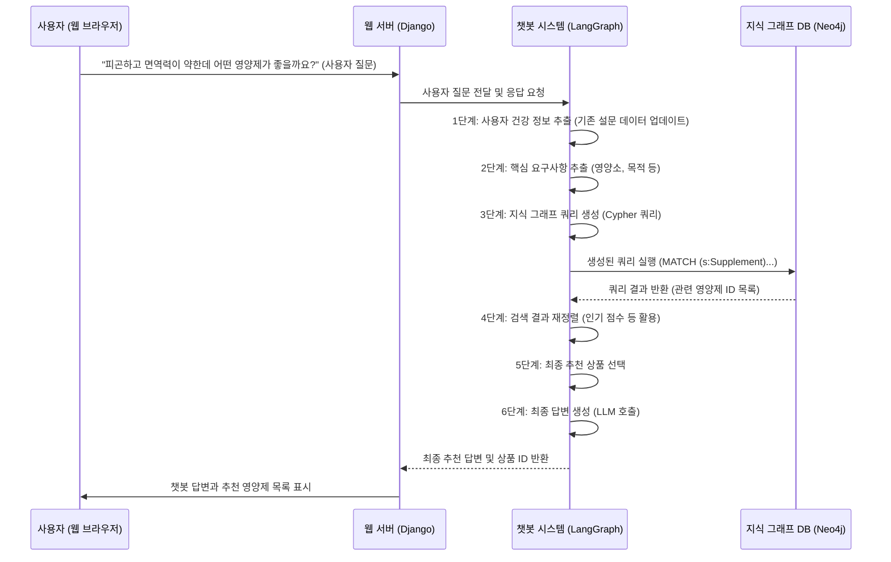

# Chapter 5: 영양제 챗봇 시스템

안녕하세요! `SKN10-FINAL-2Team` 프로젝트 튜토리얼의 다섯 번째 챕터에 오신 것을 환영합니다. [챕터 4: 마이페이지 개인화 기능](04_마이페이지_개인화_기능_.md)에서는 사용자가 자신의 건강 정보를 입력하고 관리하며, 맞춤형 건강 점수와 추천사항을 제공받는 개인화된 마이페이지 기능에 대해 배웠습니다. 이제 우리는 이러한 개인화된 정보를 활용하여 사용자에게 더욱 강력하고 직관적인 경험을 제공할 차례입니다. 바로 `영양제 챗봇 시스템`입니다.

## 1. '나만의 전담 건강 상담사': 영양제 챗봇 시스템은 왜 필요할까요?

여러분은 영양제를 구매할 때 어떤 고민을 하시나요? "내 건강 상태에는 어떤 영양제가 좋을까?", "피로 회복에 효과적인 비타민 C는 어떤 제품이 있지?", "특정 성분에 알레르기가 있는데 어떤 영양제를 피해야 할까?"와 같이 복잡하고 개인화된 질문들이 많을 것입니다. 수많은 영양제 정보 속에서 나에게 딱 맞는 제품을 찾는 것은 결코 쉬운 일이 아닙니다.

우리 프로젝트의 `영양제 챗봇 시스템`은 이러한 고민을 해결해주는 '나만의 전담 건강 상담사'와 같습니다. 사용자가 마치 사람과 대화하듯이 자신의 건강 상태나 궁금한 점을 질문하면, 챗봇은 이 질문을 이해하고 사용자의 기존 건강 정보(마이페이지 설문 등)를 바탕으로 가장 적합한 영양제를 추천해줍니다. 단순히 정보를 나열하는 것을 넘어, "왜 이 영양제를 추천하는지"에 대한 이유와 생활 습관 조언까지 제공하는 똑똑한 시스템입니다.

만약 영양제 챗봇 시스템이 없다면 어떤 문제가 생길까요?
*   사용자는 복잡한 영양제 정보를 스스로 찾아야 합니다.
*   개인의 건강 상태를 고려한 맞춤형 추천을 받기 어렵습니다.
*   영양제 선택에 대한 확신이 부족하여 구매를 망설일 수 있습니다.

이러한 문제를 해결하기 위해 `영양제 챗봇 시스템`이 필요합니다. 이 시스템은 인공지능 기술을 활용하여 사용자의 질문을 이해하고, 방대한 영양제 데이터베이스와 사용자의 개인화된 건강 데이터를 결합하여 최적의 답변과 맞춤형 추천을 제공합니다.

### 1.1. 챗봇의 핵심 기술: LangGraph와 Neo4j

우리 영양제 챗봇은 두 가지 핵심 기술을 사용하여 복잡한 추천 과정을 수행합니다.

*   **LangGraph (랭그래프): AI 프로세스의 '오케스트라 지휘자'**
    LangGraph는 여러 단계의 인공지능 처리 과정을 체계적으로 연결하고 조율하는 프레임워크입니다. 마치 오케스트라의 지휘자가 다양한 악기(각 AI 모듈)들을 조화롭게 이끌어 하나의 아름다운 음악(최종 답변)을 만들어내듯이, LangGraph는 사용자의 질문을 분석하는 AI, 데이터베이스에서 정보를 찾아오는 AI, 최종 답변을 생성하는 AI 등 여러 '전문가'들을 순서에 맞게 호출하고 그 결과를 통합합니다. 이를 통해 복잡한 질문에 대해서도 단계별로 논리적인 추론을 거쳐 정확한 답변을 제공할 수 있게 됩니다.

*   **Neo4j (네오포제이): '영양제 지식 그래프'**
    Neo4j는 데이터 간의 '관계'를 그래프 형태로 저장하고 탐색하는 데 특화된 데이터베이스입니다. 일반적인 데이터베이스가 표 형태로 데이터를 저장한다면, Neo4j는 영양소, 질병, 효능, 성분, 제품 등 다양한 정보들을 점(노드)과 선(관계)으로 연결하여 복잡한 지식망을 구성합니다. 예를 들어, "비타민 C"가 어떤 "효능"(면역력 강화)을 가지고, 어떤 "제품"에 포함되어 있으며, 어떤 "증상"(피로)에 도움이 되는지 등을 한눈에 파악할 수 있도록 합니다. 이 '지식 그래프' 덕분에 챗봇은 사용자의 질문에 대해 단순히 키워드 검색을 넘어, 관계에 기반한 깊이 있는 분석과 추천을 할 수 있습니다.

## 2. 영양제 챗봇의 대화 흐름 살펴보기

그렇다면 사용자가 챗봇에게 질문했을 때, 내부적으로 어떤 과정들이 일어날까요? 마치 복잡한 요리가 여러 단계를 거쳐 완성되듯이, 챗봇의 답변 생성 과정도 여러 단계로 나뉘어 진행됩니다.



이 다이어그램은 챗봇이 사용자의 질문에 답하기 위해 거치는 주요 단계를 보여줍니다. 각 단계는 특정 '전문가(AI 모듈)'가 처리하며, 그 결과는 다음 단계로 전달되어 최종 답변을 완성합니다. 특히 Neo4j 그래프 데이터베이스는 이 과정에서 핵심적인 '영양제 지식 탐색' 역할을 수행합니다.

## 3. 챗봇 시스템 핵심 기능 상세 구현

이제 위에서 살펴본 대화 흐름을 바탕으로 실제 코드가 어떻게 동작하는지 더 자세히 알아보겠습니다.

### 3.1. 챗봇의 '뇌' 초기화: `Chatbot/apps.py`

Django 애플리케이션이 시작될 때, 챗봇 시스템의 핵심인 LangGraph 워크플로우를 미리 초기화합니다. 이렇게 하면 사용자가 챗봇에게 질문할 때마다 시스템을 새로 만들 필요 없이, 이미 준비된 워크플로우를 바로 사용할 수 있어 빠르게 응답할 수 있습니다.

**`django-server\Chatbot\apps.py`** 파일의 핵심 부분:

```python
# django-server\Chatbot\apps.py
from django.apps import AppConfig
# ... (생략: 다른 임포트) ...

class ChatbotConfig(AppConfig):
    default_auto_field = 'django.db.models.BigAutoField'
    name = 'Chatbot'

    def ready(self):
        """
        장고 앱이 로드될 때 호출됩니다. Agent 워크플로우를 초기화합니다.
        """
        # 앱이 리로드되는 경우는 제외 (개발 서버에서 두 번 실행되는 것을 방지)
        if 'runserver' not in sys.argv:
            return

        from Chatbot.agent_system.agent import SupplementRecommendationAgent
        print("Initializing LangGraph Agent System with PostgreSQL persistence...")
        
        # 클래스 메서드를 호출하여 워크플로우 초기화
        SupplementRecommendationAgent.create_supplement_recommendation_workflow()
        print("LangGraph Agent System Initialized.")
        
        # 앱 종료 시 자원 정리를 위한 핸들러 등록
        def cleanup_resources():
            print("Cleaning up LangGraph resources...")
            SupplementRecommendationAgent.cleanup()
            print("Cleanup complete.")
        
        atexit.register(cleanup_resources)
        # ... (생략: 시그널 핸들러 등록) ...
```

이 코드는 Django 애플리케이션이 준비될 때 (`ready` 메서드), `SupplementRecommendationAgent` 클래스의 `create_supplement_recommendation_workflow()` 메서드를 호출하여 LangGraph 워크플로우를 한 번만 초기화합니다. 또한, 애플리케이션이 종료될 때 데이터베이스 연결과 같은 자원들을 깔끔하게 정리하는 `cleanup_resources` 함수를 등록합니다.

### 3.2. 챗봇 대화 및 기록 저장: `Chatbot/models.py`

챗봇과의 모든 대화 내용, 추천 로그, 그리고 채팅방 정보 등은 데이터베이스에 체계적으로 저장됩니다. 이를 통해 사용자들은 이전 대화를 이어갈 수 있고, 서비스 운영자는 챗봇의 성능을 분석할 수 있습니다.

**`django-server\Chatbot\models.py`** 파일의 주요 모델들:

```python
# django-server\Chatbot\models.py
from django.db import models
from django.conf import settings
from Product.models import Products # 영양제 상품 정보를 위해 필요

class ChatRooms(models.Model):
    id = models.AutoField(primary_key=True)
    user = models.ForeignKey(settings.AUTH_USER_MODEL, on_delete=models.CASCADE, related_name='chat_rooms')
    title = models.CharField(max_length=255) # 채팅방 제목 (첫 질문으로 자동 생성)
    created_at = models.DateTimeField(auto_now_add=True)

class ChatMessages(models.Model):
    id = models.AutoField(primary_key=True)
    chat_room = models.ForeignKey(ChatRooms, on_delete=models.CASCADE, related_name='messages')
    sender_type = models.CharField(max_length=20)  # 'user' 또는 'assistant'
    message = models.TextField()
    product_ids = models.JSONField(blank=True, null=True)  # 추천된 상품 ID 리스트
    created_at = models.DateTimeField(auto_now_add=True)
    
class RecommendationLog(models.Model):
    id = models.AutoField(primary_key=True)
    user = models.ForeignKey(settings.AUTH_USER_MODEL, on_delete=models.CASCADE, related_name='recommendation_logs')
    recommended_product = models.ForeignKey(Products, on_delete=models.CASCADE, related_name='recommendation_logs')
    timestamp = models.DateTimeField(auto_now_add=True)
    reason = models.TextField() # 추천 이유
```

*   `ChatRooms`: 사용자와 챗봇 간의 개별 대화 세션(채팅방)을 나타냅니다. 각 채팅방은 고유한 제목을 가지며, 사용자와 연결됩니다.
*   `ChatMessages`: 특정 `ChatRooms`에 속한 모든 메시지들을 저장합니다. 메시지를 보낸 주체(`sender_type`: 'user' 또는 'assistant'), 메시지 내용, 그리고 챗봇이 추천한 상품이 있다면 해당 상품들의 ID 목록(`product_ids`)을 함께 저장합니다.
*   `RecommendationLog`: 챗봇이 사용자에게 특정 영양제를 추천했을 때, 어떤 상품을 왜 추천했는지 기록합니다.

이 모델들은 챗봇 대화의 지속성과 개인화된 추천 기록을 관리하는 데 필수적인 데이터 저장소 역할을 합니다.

### 3.3. 챗봇과의 대화 처리: `Chatbot/views.py`

사용자가 웹 페이지에서 챗봇에게 메시지를 보내면, 이 메시지는 Django 서버의 `ChatWithNutiAPIView`로 전달됩니다. 이 뷰는 메시지를 받아 LangGraph 워크플로우를 실행하고, 그 결과를 사용자에게 반환합니다.

**`django-server\Chatbot\views.py`** 파일의 `ChatWithNutiAPIView` 핵심 부분:

```python
# django-server\Chatbot\views.py
from rest_framework.views import APIView
from rest_framework.response import Response
from rest_framework import status
from Chatbot.agent_system.agent import SupplementRecommendationAgent # Agent 클래스 임포트
from .models import ChatRooms, ChatMessages
import json
from rest_framework.permissions import IsAuthenticated

class ChatWithNutiAPIView(APIView):
    permission_classes = [IsAuthenticated] # 로그인된 사용자만 접근 가능

    def post(self, request, *args, **kwargs):
        try:
            chat_room_id = request.data.get('chat_room_id')
            user_query = request.data.get('user_query')
            user = request.user # 현재 로그인한 사용자 객체

            if not user_query: # 사용자 쿼리가 없으면 에러 반환
                return Response({"error": "사용자 쿼리가 제공되지 않았습니다."}, status=status.HTTP_400_BAD_REQUEST)

            # 새 채팅방 생성 또는 기존 채팅방 가져오기
            if not chat_room_id:
                chat_room = ChatRooms.objects.create(user=user, title=user_query[:30] + "...")
                chat_room_id = chat_room.id
            else:
                chat_room = ChatRooms.objects.get(id=chat_room_id, user=user) # 사용자 소유 확인

            # 사용자 메시지 저장
            ChatMessages.objects.create(chat_room=chat_room, sender_type='user', message=user_query)

            # LangGraph 워크플로우 가져오기
            agent_workflow = SupplementRecommendationAgent.get_workflow()
            if not agent_workflow:
                return Response({"error": "Agent workflow not initialized."}, status=status.HTTP_500_INTERNAL_SERVER_ERROR)

            # LangGraph 스레드 설정 (채팅방 ID 사용) - 이전 대화 상태 유지
            thread_config = SupplementRecommendationAgent.get_thread_config(chat_room_id)
            
            # 초기 상태 설정 (필요한 경우 사용자 건강 정보 포함)
            # 여기서는 예시로 고정된 건강 정보를 사용하지만, 실제로는 DB에서 가져올 수 있습니다.
            initial_state = { "user_query": user_query, "user_health_info": { /* ... 사용자 건강 정보 ... */ } }

            # LangGraph 워크플로우 실행
            if not chat_room_id or ChatMessages.objects.filter(chat_room_id=chat_room_id).count() <= 1:
                # 새 대화 시작 또는 첫 메시지일 경우 초기 상태 전달
                final_state = agent_workflow.invoke(initial_state, thread_config)
            else:
                # 기존 대화 계속 - 쿼리만 업데이트하고 이전 상태는 체크포인터에서 로드
                final_state = agent_workflow.invoke({"user_query": user_query}, thread_config)
                
            ai_response = final_state.get("final_recommendation", "")
            product_ids = final_state.get("product_ids", []) # LangGraph에서 받은 상품 ID 리스트

            # AI 응답 저장
            ChatMessages.objects.create(chat_room=chat_room, sender_type='assistant', message=ai_response, product_ids=product_ids)

            return Response({
                "final_recommendation": ai_response,
                "product_ids": product_ids,
                "chat_room_id": chat_room_id
            }, status=status.HTTP_200_OK)

        except Exception as e:
            return Response({"error": f"An error occurred: {str(e)}"}, status=status.HTTP_500_INTERNAL_SERVER_ERROR)
```

이 코드를 간단히 설명하자면:
1.  `@permission_classes([IsAuthenticated])`를 통해 로그인된 사용자만 이 API에 접근할 수 있도록 합니다.
2.  사용자의 질문(`user_query`)과 현재 채팅방 ID(`chat_room_id`)를 받습니다.
3.  새로운 채팅이라면 `ChatRooms` 모델에 새 채팅방을 생성하고, 기존 채팅방이라면 해당 채팅방을 가져옵니다.
4.  사용자의 메시지를 `ChatMessages`에 저장합니다.
5.  `SupplementRecommendationAgent.get_workflow()`를 호출하여 LangGraph 워크플로우를 가져옵니다.
6.  `agent_workflow.invoke()`를 사용하여 LangGraph 워크플로우를 실행합니다. 이때 `user_query`와 `user_health_info`(마이페이지 설문 등에서 가져온 사용자 정보)를 초기 상태로 전달합니다. `thread_config`를 통해 각 채팅방별로 대화 상태가 독립적으로 유지됩니다.
7.  워크플로우 실행이 완료되면, 최종적으로 챗봇이 생성한 답변(`final_recommendation`)과 추천된 상품 ID 목록(`product_ids`)을 `final_state`에서 가져옵니다.
8.  챗봇의 답변과 추천 상품 ID를 `ChatMessages`에 저장하고, 사용자에게 응답으로 반환합니다.

### 3.4. 챗봇의 '지휘자'와 '전문가'들: `Chatbot/agent_system/agent.py` & `nodes.py`

`LangGraph`는 여러 AI 모델(여기서는 "노드"라고 부릅니다)을 연결하여 복잡한 작업을 수행하는 '그래프'를 만듭니다. `agent.py`는 이 그래프를 구성하고, `nodes.py`는 각 노드(단계)가 수행하는 구체적인 작업을 정의합니다.

#### 3.4.1. LangGraph 워크플로우 구성: `Chatbot/agent_system/agent.py`

이 파일은 챗봇 시스템의 전체 흐름을 정의합니다. 앞서 설명한 6단계의 처리 과정을 각각의 '노드'로 정의하고, 이 노드들이 어떤 순서로 실행되어야 하는지 '엣지'로 연결합니다.

**`django-server\Chatbot\agent_system\agent.py`** 파일의 `create_supplement_recommendation_workflow` 핵심 부분:

```python
# django-server\Chatbot\agent_system\agent.py
from Chatbot.agent_system.nodes import (
    AgentState, extract_health_info, extract_comprehensive_info,
    build_kag_query, send_kag_query, rerank_agent, select_product, final_answer
)
from langgraph.graph import StateGraph, END
from langgraph.checkpoint.postgres import PostgresSaver # 상태 영속성

class SupplementRecommendationAgent:
    _workflow = None # 워크플로우 인스턴스를 저장할 클래스 변수
    _pool = None # DB 커넥션 풀을 저장할 클래스 변수

    @classmethod
    def create_supplement_recommendation_workflow(cls):
        if cls._workflow is None:
            workflow = StateGraph(AgentState) # AgentState는 챗봇의 '공유 메모리'

            # 각 단계(노드) 추가
            workflow.add_node("extract_health_info", extract_health_info)
            workflow.add_node("extract_comprehensive_info", extract_comprehensive_info)
            workflow.add_node("build_kag_query", build_kag_query)
            workflow.add_node("send_kag_query", send_kag_query)
            workflow.add_node("rerank_agent", rerank_agent)
            workflow.add_node("select_product", select_product)
            workflow.add_node("final_answer", final_answer)

            # 노드 연결 (순서 정의)
            workflow.add_edge("extract_health_info", "extract_comprehensive_info")
            workflow.add_edge("extract_comprehensive_info", "build_kag_query")
            workflow.add_edge("build_kag_query", "send_kag_query")
            workflow.add_edge("send_kag_query", "rerank_agent")
            workflow.add_edge("rerank_agent", "select_product")
            workflow.add_edge("select_product", "final_answer")
            workflow.add_edge("final_answer", END) # 최종 답변 후 종료

            # 시작점 설정
            workflow.set_entry_point("extract_health_info")

            # PostgreSQL 체크포인터 설정 (대화 기록 영속성)
            pool = cls.get_db_connection_pool()
            checkpointer = PostgresSaver(pool)
            checkpointer.setup()
            
            cls._workflow = workflow.compile(checkpointer=checkpointer)
            print("LangGraph workflow compiled with PostgreSQL persistence.")
        return cls._workflow

    @classmethod
    def get_workflow(cls):
        # 초기화된 워크플로우 반환 (없으면 초기화)
        if cls._workflow is None:
            cls.create_supplement_recommendation_workflow()
        return cls._workflow
    
    @classmethod
    def get_thread_config(cls, thread_id):
        # 각 스레드(채팅방)별로 상태를 분리하여 관리
        return {"configurable": {"thread_id": str(thread_id)}}
```

이 코드는 다음과 같이 작동합니다:
1.  `StateGraph(AgentState)`를 사용하여 새로운 워크플로우를 생성합니다. `AgentState`는 챗봇의 '공유 메모리'와 같아서, 각 노드가 이 `AgentState` 객체를 통해 정보를 주고받으며 대화 상태를 유지합니다.
2.  `add_node()`를 사용하여 `nodes.py`에 정의된 각 기능(예: `extract_health_info`, `build_kag_query`)을 챗봇의 독립적인 '전문가'로 추가합니다.
3.  `add_edge()`를 사용하여 각 전문가들이 어떤 순서로 협력할지 정의합니다. 예를 들어, `extract_health_info`가 끝나면 `extract_comprehensive_info`가 실행되도록 연결합니다.
4.  `set_entry_point()`로 워크플로우의 시작점을 정합니다.
5.  `PostgresSaver`를 `checkpointer`로 설정하여, 모든 대화 상태가 PostgreSQL 데이터베이스에 자동으로 저장되고 로드되도록 합니다. 이를 통해 사용자가 앱을 닫았다 다시 열어도 이전 대화를 이어서 할 수 있습니다.

#### 3.4.2. 챗봇의 '전문가'들: `Chatbot/agent_system/nodes.py`

이 파일은 LangGraph 워크플로우의 각 '노드'가 수행하는 구체적인 로직을 정의합니다. 각 노드는 `AgentState`를 입력으로 받아 특정 작업을 수행하고, 변경된 `AgentState`의 일부를 반환하여 다음 노드로 전달합니다.

**`django-server\Chatbot\agent_system\nodes.py`** 파일의 핵심 부분:

```python
# django-server\Chatbot\agent_system\nodes.py
from typing import Dict, Any, List, TypedDict, Optional
from openai import OpenAI # LLM 사용
import json
from dotenv import load_dotenv
import os
from langchain_neo4j import Neo4jGraph, GraphCypherQAChain # Neo4j 연결
from langchain_openai import ChatOpenAI # LLM (LangChain용)
from Product.models import Products # 상품 정보 조회

load_dotenv()
client = OpenAI(api_key=os.getenv("OPENAI_API_KEY")) # OpenAI 클라이언트 초기화

# 1. 상태 정의 (챗봇의 '공유 메모리' 구조)
class AgentState(TypedDict):
    user_query: str # 사용자 질문
    user_health_info: Dict[str, any] # 사용자 건강 정보
    extracted_info: Dict[str, any] # 질문에서 추출된 핵심 정보 (영양소, 목적 등)
    kag_query: str # Neo4j Cypher 쿼리
    kag_results: List[any] # Neo4j 검색 결과 (상품 ID 목록)
    rerank_results: List[any] # 재정렬된 검색 결과
    final_results: List[any] # 최종 선택된 상품 정보
    final_recommendation: str # 최종 챗봇 답변 텍스트
    product_ids: List[int] # 추천된 상품 ID 리스트 (views.py로 전달)

# 2. extract_health_info: 사용자 입력에서 건강 정보 추출/업데이트
def extract_health_info(state: AgentState) -> Dict[str, Any]:
    user_query = state["user_query"]
    current_health_data = state.get("user_health_info", {})
    # LLM (GPT-4o-mini)을 사용하여 user_query에서 건강 관련 정보 추출 및 current_health_data 업데이트
    # 시스템 프롬프트: 기존 건강 데이터와 사용자 쿼리를 바탕으로 업데이트된 건강 정보 JSON을 요청
    # response_format={"type": "json_object"}를 통해 JSON 형식 강제
    # (세부 LLM 호출 로직은 생략)
    # ... (LLM 호출 및 결과 파싱) ...
    result = {"updated_health_info": { /* ... LLM이 추출한 업데이트된 건강 정보 ... */ }}
    return {"user_health_info": result.get("updated_health_info", current_health_data)}

# 3. extract_comprehensive_info: 영양소, 맛, 종류 등 상세 정보 추출
def extract_comprehensive_info(state: AgentState) -> Dict[str, Any]:
    query = state["user_query"]
    # LLM (GPT-4o-mini)을 사용하여 user_query에서 영양소, 맛, 영양제 종류 등 상세 정보 추출
    # 시스템 프롬프트: 추출할 정보 카테고리(nutrients, flavors 등)와 추출 규칙을 명시
    # (세부 LLM 호출 로직은 생략)
    # ... (LLM 호출 및 결과 파싱) ...
    extracted_info = { /* ... LLM이 추출한 상세 정보 ... */ }
    return {"extracted_info": extracted_info}

# 4. build_kag_query: 지식 그래프 DB (Neo4j) 쿼리 생성
def build_kag_query(state: AgentState) -> Dict[str, Any]:
    extracted_info = state.get("extracted_info", {})
    # Neo4j Graph 및 LangChain GraphCypherQAChain 설정
    # GraphCypherQAChain은 LLM과 Neo4j 스키마를 바탕으로 자연어 질문을 Cypher 쿼리로 변환
    # (세부 LangChain GraphCypherQAChain 설정 및 LLM 호출 로직 생략)
    # ... (LLM 호출 및 Cypher 쿼리 추출) ...
    cypher_query = "MATCH (s:Supplement) RETURN s.id LIMIT 20" # 예시 쿼리
    return {"kag_query": cypher_query}

# 5. send_kag_query: 생성된 Cypher 쿼리를 Neo4j에 실행
def send_kag_query(state: AgentState) -> Dict[str, Any]:
    # Neo4j 드라이버를 사용하여 state["kag_query"]에 담긴 쿼리를 실행
    # (세부 Neo4j 연결 및 쿼리 실행 로직 생략)
    results = [{"s.id": 1}, {"s.id": 2}] # 예시 결과 (상품 ID 목록)
    return {"kag_results": results}

# 6. rerank_agent: 검색 결과 재정렬
def rerank_agent(state: AgentState) -> Dict[str, Any]:
    # kag_results(Neo4j 검색 결과)를 바탕으로 상품의 인기 점수 등
    # 다른 기준을 적용하여 재정렬하는 로직 (이 챕터에서는 간단히 그대로 반환)
    return {"rerank_results": state["kag_results"]}

# 7. select_product: 최종 추천 상품 선택
def select_product(state: AgentState) -> Dict[str, Any]:
    # rerank_results에서 최종적으로 사용자에게 추천할 상품들을 선택하는 로직
    # (이 챕터에서는 간단히 그대로 반환)
    return {"final_results": state["rerank_results"]}

# 8. final_answer: 최종 답변 생성
def final_answer(state: AgentState) -> Dict[str, Any]:
    # 최종 선택된 상품 정보와 사용자 건강 정보를 바탕으로 LLM (GPT-4o-mini)을 사용하여
    # 사용자에게 제공할 최종 답변 텍스트와 추천 상품 ID 리스트를 생성
    product_ids_from_results = [res['s.id'] for res in state['final_results'] if 's.id' in res]
    simplified_product_details = []
    for p_id in product_ids_from_results:
        try:
            # Products 모델에서 상품 정보 조회 (Product.models의 Products 사용)
            product = Products.objects.get(id=p_id)
            simplified_product_details.append({
                'title': product.title, 'brand': product.brand, 'average_rating': product.average_rating,
                'ingredients': product.ingredients # LLM이 답변 생성에 참고할 수 있도록 일부 필드만 전달
            })
        except Products.DoesNotExist:
            print(f"상품 ID {p_id}를 찾을 수 없습니다.")
    
    # 시스템 프롬프트: 추천 이유, 추가 조언 포함하여 사용자에게 친근하고 전문적인 답변 요청
    # 사용자 컨텍스트: user_query, user_health_info, simplified_product_details 포함
    # (세부 LLM 호출 로직 생략)
    final_recommendation_text = "안녕하세요! 당신의 건강 상태를 분석한 결과, 다음 영양제들을 추천합니다." # 예시 답변
    
    return {"final_recommendation": final_recommendation_text, "product_ids": product_ids_from_results}
```

이 코드는 다음과 같이 작동합니다:
1.  `AgentState`는 챗봇이 대화 과정에서 공유하는 모든 데이터를 한곳에 모아둔 '블랙보드(칠판)' 또는 '공유 메모리'와 같습니다. 각 노드는 이 `AgentState` 객체를 읽고, 필요한 정보만 업데이트하여 다시 `AgentState`에 저장합니다.
2.  `extract_health_info` 노드는 사용자의 질문(`user_query`)을 분석하여 기존 [마이페이지 개인화 기능](04_마이페이지_개인화_기능_.md)에서 저장된 건강 정보(`user_health_info`)를 업데이트합니다. 예를 들어, "최근에 운동을 시작했어요"라는 말에서 '규칙적 운동' 항목을 '예'로 변경하는 식입니다.
3.  `extract_comprehensive_info` 노드는 사용자 질문에서 영양소, 맛, 영양제 종류, 수량, 가격 등 영양제 검색에 필요한 구체적인 정보를 추출합니다.
4.  `build_kag_query` 노드는 `extracted_info`를 바탕으로 Neo4j 지식 그래프 데이터베이스에서 영양제를 검색하기 위한 Cypher 쿼리를 생성합니다. 이 과정에서 `LangChain`의 `GraphCypherQAChain`이 사용되어, 영양제 지식 그래프의 복잡한 구조를 이해하고 가장 적합한 쿼리를 자동으로 만들어냅니다.
5.  `send_kag_query` 노드는 `build_kag_query`에서 생성된 Cypher 쿼리를 실제로 Neo4j 데이터베이스에 전송하고, 검색된 영양제들의 ID 목록을 가져옵니다.
6.  `rerank_agent`와 `select_product` 노드는 검색된 영양제 목록을 [챕터 2: 인기 점수 계산 로직](02_인기_점수_계산_로직_.md)에서 다룬 인기 점수 등을 활용하여 재정렬하고 최종 추천 상품을 선택합니다. (이 챕터에서는 간단히 검색 결과를 그대로 전달하는 것으로 설명합니다.)
7.  `final_answer` 노드는 최종적으로 선택된 상품 정보와 사용자의 건강 정보, 그리고 초기 질문을 종합하여 OpenAI의 LLM(거대 언어 모델)을 이용해 사용자에게 친근하고 전문적인 최종 추천 답변을 생성합니다. 이때 추천된 상품들의 ID 목록도 함께 반환하여 웹 페이지에 표시할 수 있도록 합니다.

### 3.5. 챗봇 화면 구성: `Chatbot/ChatNuti.html`

백엔드에서 챗봇의 답변과 추천 상품 ID를 받았다면, 이제 이를 사용자에게 보기 좋게 표시해야 합니다. `django-server\templates\Chatbot\ChatNuti.html` 파일은 챗봇의 사용자 인터페이스를 담당합니다.

**`django-server\templates\Chatbot\ChatNuti.html`** 파일의 핵심 부분:

```html
<!DOCTYPE html>
<html lang="ko">
<head>
    <meta charset="UTF-8">
    <title>챗봇</title>
    
    <script src="https://cdn.jsdelivr.net/npm/marked/marked.min.js"></script>
    <link rel="stylesheet" href=""/>
    <script src="" defer></script>
    <style> /* ... Tailwind CSS 및 커스텀 스타일 생략 ... */ </style>
</head>
<body class="bg-yellow-50">
    <div class="relative h-screen overflow-hidden">
        <aside class="sidebar fixed h-full w-72 bg-yellow-100 p-6 z-40">
            <button id="new-chat-btn">새 채팅</button>
            <nav><div id="chat-rooms-container"></div></nav> {# 채팅방 목록 표시 #}
        </aside>
        <main class="main-content h-screen flex justify-center pl-64 overflow-y-auto">
            <div class="chat-wrapper flex flex-col h-auto min-h-screen pt-8">
                <div class="flex-1" id="chat-container">
                    {# 초기 챗봇 인사말 #}
                    <div class="bg-white p-4 rounded-lg shadow message-animation bot-message">
                        <div class="markdown-content">
                            <p class="text-gray-700">안녕하세요! 저는 Nuti 영양제 추천 챗봇입니다. 건강 상태나 원하는 영양제에 대해 물어보세요.</p>
                        </div>
                    </div>
                </div>
                {# 입력 영역 #}
                <div class="sticky bottom-0 w-full bg-yellow-50">
                    <div class="flex items-center bg-yellow-100 rounded-lg p-3">
                        <textarea id="user-input" placeholder="메시지를 입력하세요..." rows="1"></textarea>
                        <button id="send-button">
                            <span class="material-icons">send</span>
                        </button>
                    </div>
                </div>
            </div>
        </main>
    </div>
    <script src=""></script> {# 사용자 인증 관련 스크립트 #}
     {# 상품 상세 정보 모달 포함 #}
    <script>
        document.addEventListener('DOMContentLoaded', function() {
            const chatContainer = document.getElementById('chat-container');
            const userInput = document.getElementById('user-input');
            const sendButton = document.getElementById('send-button');
            let currentChatRoomId = null;

            // 채팅 메시지 추가 함수
            function addMessage(message, isUser, productIds = null) {
                // isUser에 따라 사용자 메시지 또는 챗봇 메시지 스타일 적용
                // marked.parse(message)를 사용하여 마크다운을 HTML로 변환
                // productIds가 있으면, Product/details/ API를 호출하여 상품 정보를 가져온 후
                // 상품 캐러셀을 생성하고 챗봇 메시지와 함께 표시
                // (세부 구현 로직 생략, 기존 HTML 코드 참조)
            }

            // 메시지 전송 함수
            async function sendMessage() {
                const message = userInput.value.trim();
                if (message === '') return;
                addMessage(message, true); // 사용자 메시지 즉시 표시
                // ... (로딩 표시) ...

                const messageData = { user_query: message, chat_room_id: currentChatRoomId };
                const accessToken = localStorage.getItem('accessToken'); // 인증 토큰
                const response = await fetch('/Chatbot/ChatWithNuti/', {
                    method: 'POST',
                    headers: { 'Content-Type': 'application/json', 'Authorization': `Bearer ${accessToken}`, 'X-CSRFToken': getCookie('csrftoken') },
                    body: JSON.stringify(messageData)
                });
                const data = await response.json();
                // ... (로딩 숨기기) ...
                if (data.final_recommendation) {
                    addMessage(data.final_recommendation, false, data.product_ids); // 챗봇 답변 및 상품 ID 표시
                    currentChatRoomId = data.chat_room_id; // 새 채팅방 ID 업데이트
                    loadChatRooms(); // 채팅방 목록 갱신
                } else { /* ... 에러 처리 ... */ }
            }

            sendButton.addEventListener('click', sendMessage);
            userInput.addEventListener('keypress', function(e) {
                if (e.key === 'Enter' && !e.shiftKey) { e.preventDefault(); sendMessage(); }
            });

            // 채팅방 목록 불러오기 및 관리 (sidebar 관련)
            async function loadChatRooms() {
                // ... (API 호출 및 채팅방 목록 동적 생성 로직 생략, 기존 HTML/JS 코드 참조) ...
            }
            loadChatRooms(); // 페이지 로드 시 채팅방 목록 초기 로드
        });
    </script>
</body>
</html>
```

이 코드는 다음과 같이 작동합니다:
1.  **사이드바**: 왼쪽에 `new-chat-btn` (새 채팅 시작 버튼)과 `chat-rooms-container` (이전 채팅방 목록)가 있습니다. `loadChatRooms()` 함수가 `/Chatbot/chat-rooms/` API를 호출하여 사용자의 채팅방 목록을 가져와 동적으로 표시합니다.
2.  **채팅 영역**: `chat-container`에 사용자 메시지와 챗봇 메시지가 번갈아 표시됩니다. `addMessage()` 함수는 메시지가 마크다운 형식으로 오면 `marked.parse()`를 사용하여 HTML로 변환하여 보여줍니다.
3.  **상품 캐러셀**: 챗봇이 영양제를 추천할 때 `product_ids`를 함께 반환합니다. `addMessage` 함수는 이 ID들을 이용하여 `/Product/details/` API를 호출하여 상품 상세 정보를 가져온 후, 챗봇 메시지 아래에 추천 상품들을 가로로 넘길 수 있는 '캐러셀' 형태로 표시합니다. 각 상품 카드를 클릭하면 [챕터 1: 상품 데이터베이스 및 조회](01_상품_데이터베이스_및_조회_.md)에서 설명된 `product_detail_modal.html`을 통해 상세 정보를 볼 수 있습니다.
4.  **메시지 입력**: `user-input` 텍스트 영역에 사용자가 메시지를 입력하고 `send-button`을 누르면 `sendMessage()` 함수가 실행됩니다. 이 함수는 입력된 메시지를 JSON 형태로 백엔드의 `/Chatbot/ChatWithNuti/` API로 전송합니다.
5.  **보안**: [챕터 3: 사용자 계정 관리](03_사용자_계정_관리_.md)에서 배운 JWT 토큰(`accessToken`)과 CSRF 토큰을 사용하여 API 요청의 보안을 유지합니다. `auth.js` 스크립트는 이 토큰들의 유효성을 검증하고 필요한 경우 갱신합니다.

## 결론

이번 챕터에서는 사용자의 '전담 건강 상담사' 역할을 하는 `영양제 챗봇 시스템`에 대해 자세히 알아보았습니다. LangGraph라는 '오케스트라 지휘자'가 AI 프로세스를 조율하고, Neo4j '지식 그래프'가 영양제 관련 정보를 탐색하는 핵심적인 역할을 한다는 것을 이해했습니다.

사용자의 질문이 챗봇에게 전달되어 답변이 생성되기까지 `Chatbot/views.py`를 통해 요청이 처리되고, `Chatbot/agent_system/agent.py`에서 정의된 워크플로우를 따라 `Chatbot/agent_system/nodes.py`의 각 전문가(노드)들이 순차적으로 정보를 추출하고, 쿼리를 생성하며, 데이터베이스에서 검색하고, 최종 답변을 생성하는 과정을 살펴보았습니다. 또한, `Chatbot/models.py`를 통해 대화 기록이 영속적으로 저장되고, `Chatbot/ChatNuti.html`을 통해 사용자에게 친숙한 형태로 챗봇 인터페이스와 추천 영양제가 표시되는 전체적인 흐름을 이해하는 것이 중요합니다.

이제 우리는 사용자의 개인화된 건강 데이터를 바탕으로, 지능적인 챗봇을 통해 맞춤형 영양제 추천을 제공할 수 있게 되었습니다. 다음 챕터에서는 이러한 기능들이 웹 서비스에서 원활하게 작동하기 위한 필수 요소인 `API 통신 및 데이터 직렬화`에 대해 자세히 알아보겠습니다.

[챕터 6: API 통신 및 데이터 직렬화](06_api_통신_및_데이터_직렬화_.md)

---

Generated by [AI Codebase Knowledge Builder](https://github.com/The-Pocket/Tutorial-Codebase-Knowledge)