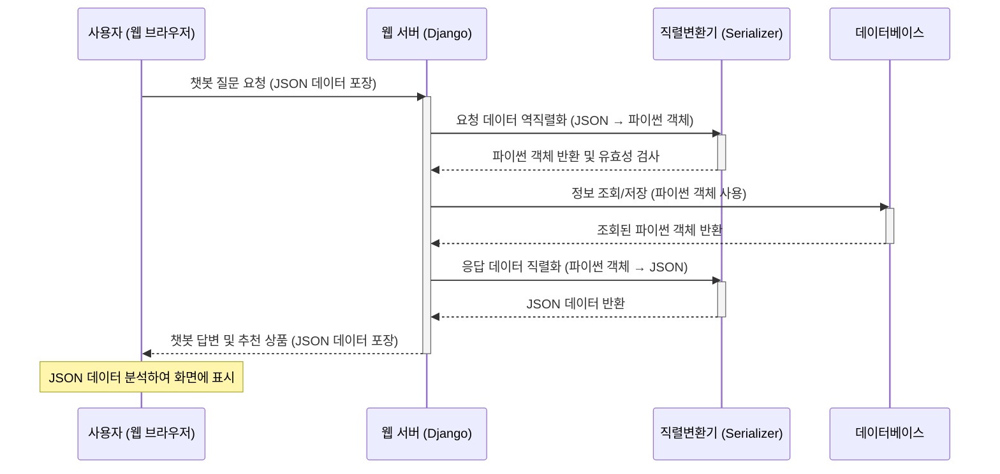

# Chapter 6: API 통신 및 데이터 직렬화


안녕하세요! `SKN10-FINAL-2Team` 프로젝트 튜토리얼의 마지막 챕터에 오신 것을 환영합니다. 이전 챕터 [영양제 챗봇 시스템](05_영양제_챗봇_시스템_.md)에서는 사용자의 건강 정보를 기반으로 똑똑하게 영양제를 추천해주는 챗봇이 어떻게 작동하는지 알아보았습니다. 챗봇이 아무리 똑똑한 답변과 추천 상품 목록을 만들어냈더라도, 이 정보가 사용자 웹 브라우저 화면에 제대로 표시되지 않는다면 아무 소용이 없겠죠?

이번 챕터에서는 웹 브라우저(프론트엔드)와 서버(백엔드)가 마치 다른 언어를 쓰는 사람들처럼 서로 어떻게 데이터를 주고받고 이해하는지, 즉 **API 통신**과 **데이터 직렬화**라는 핵심 개념에 대해 알아보겠습니다. 이 두 가지는 우리 서비스가 원활하게 작동하기 위한 필수적인 '언어'이자 '규칙'입니다.

## 1. '다국어 통역사'처럼: API 통신과 데이터 직렬화는 왜 필요할까요?

여러분이 해외여행을 가서 현지 식당에 갔다고 상상해봅시다. 여러분은 한국어를 쓰고, 식당 직원은 현지어를 씁니다. 이때 스마트폰 번역기나 통역사가 없다면 어떻게 음식을 주문하고, 음식이 어떤 재료로 만들어졌는지 알 수 있을까요? 아마 의사소통이 매우 어려울 것입니다.

우리 서비스도 마찬가지입니다.
*   **웹 브라우저(프론트엔드)**: 사용자의 화면을 구성하고 버튼 클릭 등 사용자 인터랙션을 처리합니다. 주로 HTML, CSS, JavaScript 언어를 사용합니다.
*   **서버(백엔드)**: 데이터베이스에서 정보를 가져오고, 복잡한 계산을 수행하며, 사용자 요청을 처리합니다. 주로 Python(Django), SQL 데이터베이스 언어를 사용합니다.

이처럼 서로 다른 기술 언어를 사용하는 프론트엔드와 백엔드가 원활하게 소통하며 정보를 교환하기 위해서는 마치 '다국어 통역사'와 같은 존재가 필요합니다. 이것이 바로 **API(Application Programming Interface)**와 **데이터 직렬화(Data Serialization)**의 역할입니다.

### API (Application Programming Interface): '식당 메뉴판'

API는 프론트엔드와 백엔드가 서로 데이터를 주고받는 규칙과 방법을 정의한 '약속'입니다. 마치 식당의 메뉴판처럼, 백엔드가 "나는 이런 이런 정보를 줄 수 있고, 이런 이런 요청을 처리할 수 있다"라고 미리 정해놓은 목록입니다.

*   **주문 가능한 요리 (메서드)**: GET (정보 조회), POST (정보 생성/제출), PUT/PATCH (정보 수정), DELETE (정보 삭제) 등의 HTTP 메서드를 사용합니다.
*   **요리의 이름과 재료 (엔드포인트)**: `/product/details/1/`나 `/Chatbot/ChatWithNuti/`와 같이 특정 정보를 요청하는 웹 주소를 '엔드포인트'라고 부릅니다.
*   **요리 주문 시 지켜야 할 형식**: 요청에 어떤 정보를 어떤 형태로 담아서 보내야 하는지 (예: JSON 형식).

### 데이터 직렬화 (Data Serialization): '택배 포장'

데이터 직렬화는 백엔드에서 다루는 복잡한 데이터(예: 데이터베이스에서 가져온 파이썬 객체)를 웹에서 주고받기 쉬운 표준 형식(주로 JSON)으로 변환하는 과정입니다. 마치 택배를 보낼 때 물건을 상자에 넣어 안전하게 보낼 수 있도록 포장하는 것과 같습니다.

*   **서버(백엔드)**: 데이터베이스에서 가져온 '파이썬 객체'를 웹 브라우저가 이해하기 쉬운 'JSON' 텍스트 형식으로 '포장'합니다.
*   **브라우저(프론트엔드)**: 서버로부터 받은 'JSON' 텍스트를 다시 JavaScript가 이해할 수 있는 '객체' 형태로 '개봉'하여 화면에 표시합니다.

이러한 과정을 통해 서로 다른 기술 언어를 사용하는 프론트엔드와 백엔드가 원활하게 소통하며 정보를 교환할 수 있게 됩니다.

## 2. API 통신 및 데이터 직렬화 흐름 살펴보기

사용자가 챗봇에게 질문하고 답변을 받는 과정을 예시로 API 통신과 데이터 직렬화가 어떻게 일어나는지 살펴볼까요?



이 다이어그램은 웹 브라우저와 웹 서버 사이에서 데이터가 어떻게 오고 가는지, 그리고 중간에 '직렬변환기'가 어떤 역할을 하는지 보여줍니다. 핵심은 데이터가 네트워크를 통해 전송될 때는 모두 웹 친화적인 '텍스트' 형태(JSON)로 포장되어야 한다는 것입니다.

## 3. 우리 프로젝트의 API 통신 및 데이터 직렬화

우리 프로젝트에서는 Django와 Django REST Framework(DRF)를 사용하여 API 통신과 데이터 직렬화를 구현합니다.

### 3.1. 프론트엔드에서 서버로 요청 보내기 (JSON 직렬화)

사용자가 챗봇에게 메시지를 보낼 때, 웹 브라우저는 JavaScript의 `fetch` API를 사용하여 서버로 `POST` 요청을 보냅니다. 이때 사용자가 입력한 메시지를 서버가 이해할 수 있도록 JSON 형식으로 '직렬화'하여 전송합니다.

**`django-server\static\js\Chatbot\ChatNuti.html`** 파일의 `sendMessage` 함수 일부:

```javascript
// django-server\templates\Chatbot\ChatNuti.html (script 태그 내)
async function sendMessage() {
    const message = userInput.value.trim();
    if (message === '') return;
    addMessage(message, true); // 사용자 메시지 즉시 표시

    const messageData = { 
        user_query: message, 
        chat_room_id: currentChatRoomId 
    }; // 전송할 데이터 (JavaScript 객체)

    const accessToken = localStorage.getItem('accessToken'); // 인증 토큰 (챕터 3 참고)

    const response = await fetch('/Chatbot/ChatWithNuti/', { // 서버 API 엔드포인트
        method: 'POST', // 정보를 보낼 때는 POST 메서드 사용
        headers: {
            'Content-Type': 'application/json', // 보내는 데이터가 JSON임을 알림
            'Authorization': `Bearer ${accessToken}`, // 로그인 정보 (챕터 3 참고)
            'X-CSRFToken': getCookie('csrftoken') // 보안을 위한 CSRF 토큰
        },
        body: JSON.stringify(messageData) // JavaScript 객체를 JSON 문자열로 변환 (직렬화)
    });

    const data = await response.json(); // 서버 응답을 JSON으로 파싱 (역직렬화)
    // ... (챗봇 답변 처리 로직) ...
}
```

위 JavaScript 코드에서 `JSON.stringify(messageData)` 부분이 바로 **데이터 직렬화**를 수행합니다. `messageData`라는 JavaScript 객체를 네트워크를 통해 전송 가능한 JSON 형태의 문자열로 변환하는 것이죠. 이렇게 변환된 데이터는 HTTP 요청의 `body` 부분에 담겨 서버로 전송됩니다.

반대로 `const data = await response.json();` 부분은 서버로부터 받은 JSON 응답을 JavaScript 객체로 다시 변환하는 **데이터 역직렬화**를 수행합니다.

### 3.2. 백엔드에서 요청 받기 및 응답 보내기 (JSON 직렬화/역직렬화)

서버에서는 프론트엔드에서 보낸 JSON 데이터를 받아 파이썬 객체로 변환하고, 처리 결과를 다시 JSON으로 변환하여 프론트엔드로 보냅니다.

**`django-server\Chatbot\views.py`** 파일의 `ChatWithNutiAPIView` `post` 메서드 일부:

```python
# django-server\Chatbot\views.py
from rest_framework.views import APIView
from rest_framework.response import Response
from rest_framework import status
# ... (생략: 기타 임포트) ...

class ChatWithNutiAPIView(APIView):
    # ... (생략: permission_classes) ...

    def post(self, request, *args, **kwargs):
        try:
            # 1. 요청 데이터 받기 (JSON 자동 역직렬화)
            chat_room_id = request.data.get('chat_room_id') # request.data는 이미 파이썬 딕셔너리
            user_query = request.data.get('user_query')

            if not user_query:
                return Response({"error": "사용자 쿼리가 제공되지 않았습니다."}, status=status.HTTP_400_BAD_REQUEST)

            # ... (생략: 채팅방 및 메시지 저장 로직) ...

            # 2. 챗봇 워크플로우 실행 및 결과 받기
            # LangGraph 워크플로우는 파이썬 객체를 다룹니다.
            final_state = agent_workflow.invoke(initial_state, thread_config)
            
            ai_response = final_state.get("final_recommendation", "")
            product_ids = final_state.get("product_ids", []) # 추천된 상품 ID 리스트

            # 3. AI 응답 저장 (데이터베이스에 파이썬 객체로 저장)
            ChatMessages.objects.create(
                chat_room=chat_room,
                sender_type='assistant',
                message=ai_response,
                product_ids=product_ids # JSONField에는 파이썬 리스트/딕셔너리가 그대로 저장됨
            )

            # 4. 응답 반환 (파이썬 딕셔너리를 JSON으로 자동 직렬화)
            return Response({
                "final_recommendation": ai_response,
                "product_ids": product_ids,
                "chat_room_id": chat_room_id
            }, status=status.HTTP_200_OK)

        except Exception as e:
            return Response(
                {"error": f"An error occurred: {str(e)}"},
                status=status.HTTP_500_INTERNAL_SERVER_ERROR
            )
```

Django REST Framework의 `APIView`를 사용하면, `request.data`는 클라이언트로부터 받은 JSON 데이터를 자동으로 파이썬 딕셔너리로 **역직렬화**해줍니다. 그래서 개발자는 별도의 파싱 과정 없이 `request.data.get('키')`처럼 바로 데이터를 사용할 수 있습니다.

또한, `Response({...})` 객체를 사용하면 전달하는 파이썬 딕셔너리를 자동으로 JSON 형태의 문자열로 **직렬화**하여 클라이언트(웹 브라우저)에게 응답으로 보냅니다. 이러한 자동화된 기능 덕분에 우리는 데이터를 주고받는 과정에 집중할 수 있습니다.

### 3.3. 데이터 직렬화 및 유효성 검사 (Serializer의 역할)

앞서 본 챗봇 API는 DRF의 `APIView`가 제공하는 자동 직렬화/역직렬화 기능을 활용합니다. 하지만 우리 프로젝트의 다른 부분, 예를 들어 [사용자 계정 관리](03_사용자_계정_관리_.md) 챕터에서 보았던 회원가입처럼, 더 복잡한 데이터 변환과 유효성 검사가 필요할 때는 `Serializer`를 사용합니다.

`Serializer`는 파이썬 객체(예: Django 모델 인스턴스)를 JSON이나 XML 같은 데이터 형식으로 변환(직렬화)하거나, 반대로 외부 데이터 형식(JSON 등)을 파이썬 객체로 변환(역직렬화)하면서 동시에 데이터의 유효성까지 검사하는 '데이터 번역가이자 검수자' 역할을 합니다.

**`django-server\Account\serializers.py`** 파일의 `SignupSerializer` 일부:

```python
# django-server\Account\serializers.py
from rest_framework import serializers
from django.contrib.auth import get_user_model

User = get_user_model()

class SignupSerializer(serializers.ModelSerializer):
    # 프론트엔드에서 받을 필드들을 정의합니다.
    name = serializers.CharField(max_length=20)
    email = serializers.EmailField()
    password = serializers.CharField(write_only=True)
    birth_date = serializers.DateField(input_formats=['%Y-%m-%d', '%Y%m%d'])
    gender_id = serializers.IntegerField( # 프론트에서 받은 숫자 ID (1,2,3,4)
        min_value=1, max_value=4
    )

    class Meta:
        model = User # 이 Serializer가 어떤 Django 모델과 연결되는지 명시
        fields = ('name', 'email', 'password', 'birth_date', 'gender_id')

    # 데이터 역직렬화 및 유효성 검사
    def validate(self, data):
        # 1. 이메일 중복 확인
        if User.objects.filter(email=data.get('email')).exists():
            raise serializers.ValidationError({"email": "이미 등록된 이메일 주소입니다."})
        
        # 2. 비밀번호 길이 확인
        if len(data.get('password')) < 8:
            raise serializers.ValidationError({"password": "비밀번호는 최소 8자 이상이어야 합니다."})
        
        # 3. gender_id (숫자)를 실제 User 모델의 'gender' 필드 값('male'/'female' 문자열)으로 변환
        gender_id = data.get('gender_id')
        gender = None
        if gender_id in [1, 3]: # 1,3은 남성
            gender = 'male'
        elif gender_id in [2, 4]: # 2,4는 여성
            gender = 'female'
        data['gender'] = gender # `User` 모델에 저장될 필드값으로 추가

        return data # 유효성 검사를 통과한 데이터 반환

    # 데이터베이스에 저장될 객체 생성 (역직렬화된 데이터를 바탕으로)
    def create(self, validated_data):
        # User 모델에 없는 gender_id 필드는 제거
        validated_data.pop('gender_id') 
        # validate 메서드에서 추가한 'gender' 필드를 사용
        gender = validated_data.pop('gender') 

        user = User.objects.create_user( # CustomUser 객체 생성
            email=validated_data['email'],
            password=validated_data['password'],
            name=validated_data['name'],
            birth_date=validated_data['birth_date'],
            gender=gender, # 변환된 gender 값 저장
            is_verified=False
        )
        return user
```

이 `SignupSerializer`는 다음과 같이 작동합니다:
1.  **필드 정의**: `serializers.CharField`, `serializers.EmailField` 등으로 프론트엔드에서 받을 데이터의 종류와 형식을 정의합니다.
2.  **`Meta` 클래스**: `model = User`를 통해 어떤 Django 모델과 이 Serializer가 연결될지 명시합니다. `fields`는 이 Serializer가 어떤 모델 필드를 다룰지 결정합니다.
3.  **`validate` 메서드**: 클라이언트로부터 받은 `data`(아직 파이썬 딕셔너리 형태)에 대해 이메일 중복, 비밀번호 길이 등 추가적인 유효성 검사를 수행합니다. 특히, `gender_id`라는 숫자를 받아 `gender`라는 실제 모델 필드에 맞는 문자열 값으로 변환하는 '데이터 변환' 역할도 여기서 수행합니다.
4.  **`create` 메서드**: 모든 유효성 검사를 통과한 `validated_data`를 바탕으로 실제 `CustomUser` 모델 객체를 생성하고 데이터베이스에 저장합니다. 이때 `gender_id`처럼 모델에 없는 필드는 제거하고, 변환된 `gender` 값을 사용합니다.

이렇게 `Serializer`를 사용하면 복잡한 데이터 변환과 유효성 검사 로직을 체계적으로 관리할 수 있습니다.

**`django-server\Account\views.py`** 파일의 `SignupAPIView` `post` 메서드 일부:

```python
# django-server\Account\views.py
from rest_framework import generics, status
from rest_framework.response import Response
from .serializers import SignupSerializer # 위에서 정의한 Serializer 임포트
# ... (생략: 기타 임포트) ...

class SignupAPIView(generics.CreateAPIView):
    # ... (생략: queryset, permission_classes) ...
    serializer_class = SignupSerializer # 사용할 Serializer 지정

    def post(self, request, *args, **kwargs):
        # 1. 요청 데이터를 Serializer에 전달하여 역직렬화 및 유효성 검사
        serializer = self.get_serializer(data=request.data)
        serializer.is_valid(raise_exception=True) # 유효성 검사 실패 시 자동으로 에러 응답 반환

        # 2. 유효성 검사를 통과한 데이터로 새 사용자 객체 생성 및 DB 저장
        user = serializer.save() # SignupSerializer의 create() 메서드 호출

        # ... (생략: 이메일 인증 메일 발송 로직) ...

        # 3. 성공 응답 반환 (Response가 파이썬 딕셔너리를 JSON으로 자동 직렬화)
        return Response({
            "message": "회원가입이 성공적으로 완료되었습니다.",
            "user_email": user.email,
        }, status=status.HTTP_201_CREATED)
```

여기서 `serializer.is_valid(raise_exception=True)`는 클라이언트가 보낸 데이터가 `SignupSerializer`가 정의한 규칙에 맞는지 검사합니다. 만약 데이터가 유효하지 않으면 `Serializer`가 에러 메시지를 포함한 응답을 자동으로 생성하여 반환하므로, 개발자는 복잡한 예외 처리를 직접 작성할 필요가 없습니다. `serializer.save()`는 `SignupSerializer` 내의 `create()` 또는 `update()` 메서드를 호출하여 실제 데이터베이스 작업을 수행합니다.

### 3.4. 상품 정보 API (직렬화)

[챕터 1: 상품 데이터베이스 및 조회](01_상품_데이터베이스_및_조회_.md)에서 보았던 상품 상세 정보 조회 API도 결국 데이터베이스에서 가져온 파이썬 객체(`Products` 모델 인스턴스)를 JSON으로 '직렬화'하여 클라이언트에게 전달합니다.

**`django-server\Product\views.py`** 파일의 `get_product_details` 함수 일부:

```python
# django-server\Product\views.py
from django.shortcuts import get_object_or_404
from django.http import JsonResponse # JSON 응답을 위한 Django 내장 기능
# ... (생략: 기타 임포트) ...

def get_product_details(request, product_id=None):
    try:
        product = get_object_or_404(Products, id=product_id) # DB에서 파이썬 객체 가져오기
        
        # 파이썬 딕셔너리 형태로 데이터를 구성
        product_data = {
            'id': product.id,
            'title': product.title,
            'brand': product.brand,
            'ingredients': product.ingredients,
            'total_price': product.total_price,
            'image_link': product.image_link,
            'is_liked': False, # 좋아요 여부는 다른 챕터에서 다룸
            # ... (생략: 다른 상품 속성들) ...
        }
        
        # JsonResponse를 사용하여 파이썬 딕셔너리를 JSON으로 변환 (직렬화)하여 응답
        return JsonResponse(product_data)

    except Exception as e:
        return JsonResponse({'error': f'오류가 발생했습니다: {str(e)}'}, status=500)
```

이 코드는 Django의 `JsonResponse`를 사용하여 `product_data`라는 파이썬 딕셔너리를 자동으로 JSON 문자열로 변환하여 응답합니다. `JsonResponse`는 간단한 데이터 구조를 JSON으로 직렬화할 때 매우 편리하게 사용될 수 있습니다.

## 결론

이번 챕터에서는 웹 서비스에서 프론트엔드와 백엔드가 서로 소통하는 핵심 방식인 **API 통신**과 **데이터 직렬화/역직렬화**에 대해 자세히 알아보았습니다.
*   **API**는 웹 서비스가 제공하는 기능과 데이터를 요청하고 응답받는 '메뉴판'이자 '규칙'이며,
*   **데이터 직렬화/역직렬화**는 이러한 통신 과정에서 서로 다른 프로그래밍 언어의 데이터를 웹에서 주고받기 쉬운 표준 형식(JSON)으로 '포장하고 개봉하는' 과정임을 이해했습니다.

특히, JavaScript의 `fetch` API를 사용한 요청 전송, Django REST Framework의 `APIView`와 `Response`를 통한 자동 직렬화/역직렬화, 그리고 `Serializer`를 사용한 복잡한 데이터 변환 및 유효성 검사 과정을 살펴보았습니다. 이 모든 기술들이 유기적으로 결합되어 우리 `SKN10-FINAL-2Team` 서비스의 원활한 데이터 흐름을 가능하게 합니다.

이로써 `SKN10-FINAL-2Team` 프로젝트의 핵심 개념들을 모두 살펴보았습니다. 각 챕터에서 배운 내용들이 서로 어떻게 연결되어 하나의 완전한 서비스를 구성하는지 이해하셨기를 바랍니다.

---

Generated by [AI Codebase Knowledge Builder](https://github.com/The-Pocket/Tutorial-Codebase-Knowledge)