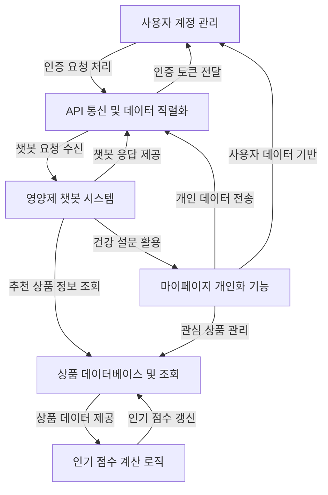

# Tutorial: SKN10-FINAL-2Team

`SKN10-FINAL-2Team` 프로젝트는 **사용자 맞춤형 영양제 추천 서비스**를 제공합니다.
사용자는 *계정 관리*를 통해 로그인하고, *마이페이지*에서 개인 건강 설문 및 좋아요한 상품을 관리할 수 있습니다.
특히, *인공지능 챗봇*은 사용자의 건강 정보와 문의를 바탕으로 *상품 데이터베이스*에서 최적의 영양제를 추천해줍니다.
모든 기능은 *API 통신*을 통해 프론트엔드와 백엔드 간에 원활하게 데이터를 주고받으며, *인기 점수 계산 로직*으로 상품의 신뢰성 있는 인기도를 제공합니다.

**Source Repository:** [https://github.com/SKNETWORKS-FAMILY-AICAMP/SKN10-FINAL-2Team.git](https://github.com/SKNETWORKS-FAMILY-AICAMP/SKN10-FINAL-2Team.git)

## Chapters

1. [상품 데이터베이스 및 조회
](01_상품_데이터베이스_및_조회_.md)
2. [인기 점수 계산 로직
](02_인기_점수_계산_로직_.md)
3. [사용자 계정 관리
](03_사용자_계정_관리_.md)
4. [마이페이지 개인화 기능
](04_마이페이지_개인화_기능_.md)
5. [영양제 챗봇 시스템
](05_영양제_챗봇_시스템_.md)
6. [API 통신 및 데이터 직렬화
](06_api_통신_및_데이터_직렬화_.md)

---

Generated by [AI Codebase Knowledge Builder](https://github.com/The-Pocket/Tutorial-Codebase-Knowledge)